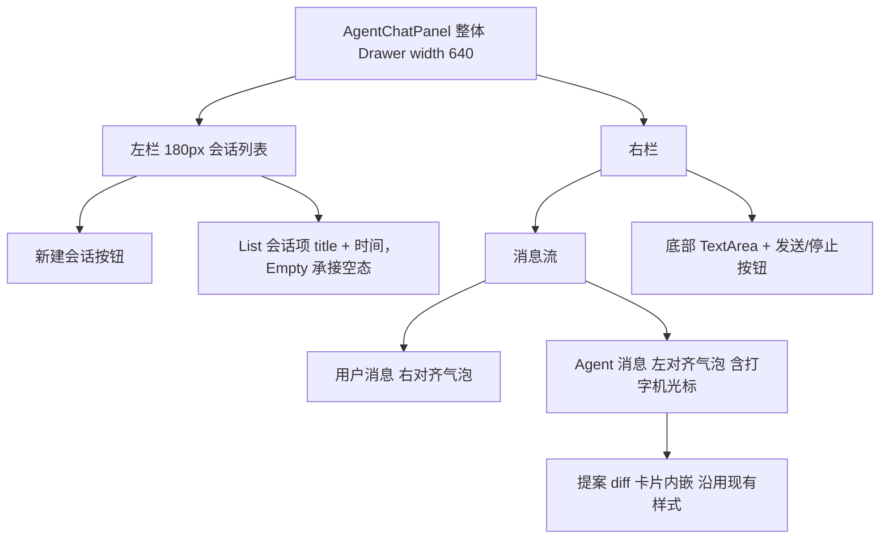
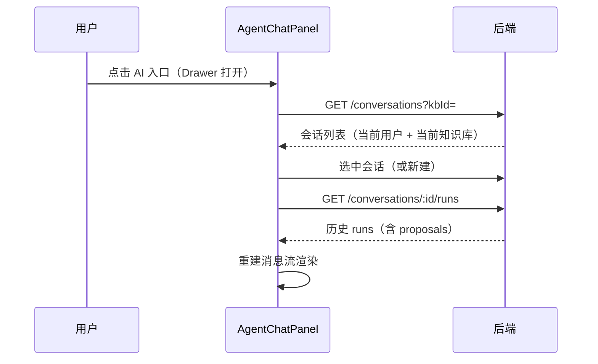
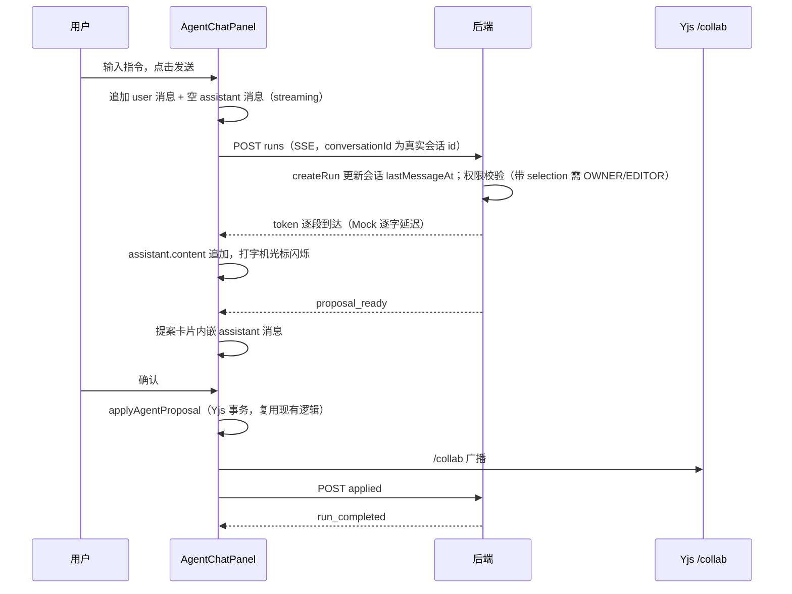

# Agent 通用对话面板（Chat Panel）设计

## 背景与目标

### 背景

现有 Agent MVP 是"选区改写专用面板"：

- 入口是工具栏 `AI rewrite` 按钮，要求进入编辑模式且必须选中文本（`knowledge-base-view/index.tsx:695-729`）
- UI 是单轮工作流：选区预览 + 指令输入 + 单个响应 `Paragraph` + 提案 diff 卡片
- `conversationId` 由前端硬编码为 `selection-${nodeId}`（`agent-workspace/index.tsx:89`），后端不校验、无会话概念、无历史查询接口

Agent 的产品定位不止选区改写，后续会扩展为整篇改写、知识库检索、外部工具（MCP）等能力。对话面板是这些能力的统一承载 UI，当前"改写专用面板"的形态无法承载多轮对话与历史。

### 目标

1. 通用 AI 入口：不依赖编辑模式与选区，任意时刻可打开对话面板，选区作为可选上下文传入。
2. 会话入库：新增 `AgentConversation` 表（用户维度），面板打开时绑定当前知识库。
3. 会话列表 + 消息流：Comate 形态双栏 UI，消息分用户/Agent 气泡，提案 diff 卡片内嵌消息流。
4. 打字机输出：Mock Provider 加逐字延迟模拟真实 LLM 流式节奏。打字机本质是模型输出特性，延迟放后端，前端保持"收到多少显示多少"。
5. 对话历史：历史 runs 重建消息流，刷新/重开面板后仍可恢复。

## 当前代码库现状

| 模块                | 位置                                                                               | 现状                                                                                                             |
| ------------------- | ---------------------------------------------------------------------------------- | ---------------------------------------------------------------------------------------------------------------- | --- | ---------------------- |
| AgentWorkspace 组件 | `apps/doc-web/src/components/agent-workspace/index.tsx`                            | 单轮 state（`streamedText/finalAnswer/proposal`），无消息数组；SSE `token` 逐段追加已打通                        |
| 入口与 Drawer       | `apps/doc-web/src/pages/knowledge-base-view/index.tsx:695-729,1068-1081,1137-1153` | AI rewrite 按钮仅编辑模式显示，要求选区；Drawer 宽 420                                                           |
| Agent 类型与 API    | `apps/doc-web/src/agent/agent.types.ts`、`agent.api.ts`                            | 事件契约完整；无 conversation/history 相关调用                                                                   |
| 后端路由            | `apps/server/src/agent/agent.controller.ts`                                        | 仅 6 个 POST 路由，`POST conversations/:id/runs` 不校验 conversationId                                           |
| 数据模型            | `apps/server/prisma/schema.prisma:255-303`                                         | 无 `AgentConversation` 表；`AgentRun.conversationId` 是普通 String，`message` + `finalAnswer` 已存（历史可重建） |
| Mock Provider       | `packages/mini-agent/src/mock-provider.ts`                                         | async generator 逐字 yield token，无延迟；改写分支由 `hasSelectionContext                                        |     | hasRewriteIntent` 触发 |
| 提案冲突处理        | `.comate/specs/agent-doc-editing/doc.md`                                           | 已稳定，本设计不触碰 `proposal-applier.ts` 与提案状态机                                                          |

## 架构与技术设计

### 会话数据模型

```prisma
model AgentConversation {
  id            String    @id @default(cuid())
  userId        String
  kbId          String
  title         String    @default("新会话")
  lastMessageAt DateTime?  // run 创建时显式更新，作为会话列表排序依据
  createdAt     DateTime  @default(now())
  updatedAt     DateTime  @updatedAt
  runs          AgentRun[]

  @@index([userId, kbId, lastMessageAt])
}

model AgentRun {
  // conversationId: String 改为外键关联
  conversation AgentConversation @relation(fields: [conversationId], references: [id], onDelete: Cascade)
  // 其余字段不变
}
```

- 会话按用户维度归属，面板打开时绑定当前 `kbId`，会话列表按 `userId + kbId` 过滤、`lastMessageAt desc` 排序。
- **排序依据是 `lastMessageAt` 而非 `updatedAt`**：`@updatedAt` 只在会话行本身被更新时变化，插入 `AgentRun` 不会触碰会话行。`createRun` 时显式将会话的 `lastMessageAt` 更新为 now。
- run 的 `kbId` 必须与会话 `kbId` 一致（本次范围）。跨知识库检索是后续特殊操作，不在本设计内。
- 会话标题：新建时默认"新会话"，run 正常结束后（COMPLETED 与 AWAITING_CONFIRMATION 均算成功）若标题仍为默认值，用用户消息截断（前 20 字）更新。实现放后端 service（`conversationService.updateTitleIfDefault`），由 orchestrator 调用，controller 保持薄；"成功后 + 标题仍为默认"保证幂等。

**迁移**：加外键后旧的 `selection-*` conversationId 无对应会话行会违反约束。migration 中按顺序：先删 `AgentProposal`（依赖 `AgentRun` 级联可一并清掉），再删 `AgentRun` 旧数据，然后建 `AgentConversation` 表、加 FK。

### 权限规则

现有 orchestrator 对每次 run 强制 `effectiveRole` 为 OWNER/EDITOR（`agent-orchestrator.ts:73-75`），与"任意时刻可打开"目标冲突。调整为：

- **带 selection 的 run（意图改写文档）**：仍要求 OWNER/EDITOR。
- **无 selection 的 run（纯问答）**：放宽为知识库成员（VIEWER 及以上）可发起。

前端入口保持对所有成员可见，VIEWER 打开面板后无选区上下文，只能问答。

### 打字机模拟（Mock 延迟）

`packages/mini-agent/src/mock-provider.ts` 是 async generator，改造点：

1. **改写分支触发条件改为仅 `hasSelectionContext`**（去掉 `hasRewriteIntent` 作为改写入口）。否则无选区时默认指令"帮我把这段话改得更专业"含"改得"，会进改写分支且 `extractSelectionContent` 找不到 `User selected text:` 标记回退为 `'selected text'`，产出的 patch 应用时必然 not_found/modified。无选区的改写意图归入问答分支，由 Agent 以文字回复。
2. 改写分支与问答分支的 token yield 之间插入 `await sleep(30ms)`（常量可配置），并响应 `request.signal?.aborted` 提前返回。`ModelRequest` 已有 `signal?: AbortSignal`（`packages/mini-agent/src/types.ts:56`），runtime 传入 `AbortSignal.timeout(runTimeoutMs)`（默认 120s），逐字延迟总量远小于预算。

前端不加动画延迟：接真实模型时 token 到达节奏即打字机节奏，前端逻辑不变。

### 前端消息模型与 UI

```ts
interface ChatMessage {
  id: string;
  role: 'user' | 'assistant';
  content: string; // 用户指令 或 Agent 回复（流式累积）
  status: 'streaming' | 'done' | 'error';
  error?: string;
  proposal?: AgentProposal; // assistant 消息可携带提案
}
```



- 会话列表用 antd v6 `List` + `Empty`（`knowledge-base-view` 已 import 二者），加载态用 `Spin`/`Skeleton`，不引入 `Menu`/`Segmented`。
- Agent 消息 streaming 时末尾渲染闪烁光标（CSS `@keyframes`，纯样式，无 JS 定时器）。
- 自动滚动策略：新消息/streaming 追加时自动滚到底；用户上滚查看历史时暂停跟随，回到底部后恢复。
- 提案卡片沿用现有 diff 样式与 Apply/Reject 交互（`index.module.less:56-103`），从单轮 state 迁移为消息内嵌。
- `AgentWorkspace` 组件改造为 `AgentChatPanel`（或保留目录名改造），`proposal-applier.ts` 不动。

### 入口改造

- 工具栏 `AI rewrite` 按钮改为通用 `AI` 按钮（RobotOutlined），对所有成员可见，不再要求编辑模式与选区。
- 有选区且编辑模式（Yjs 就绪）时构造 `AgentSelection` 作为上下文；无选区或 read 模式（read 模式无 Yjs binding，`provider` 仅在 `isEditing` 时创建）则 `selection` 传 null，只能问答。
- 类型放宽：`AgentWorkspaceProps.selection` 由必填改可选；`StartAgentRunInput.selection/nodeId/nodeBaseVersion` 由必填改可选。
- Drawer：宽度 420 → 640；open 条件去掉 `!!agentSelection`；标题文案从 "AI rewrite" 改为通用 AI 对话。

### 历史消息重建

`GET runs`（含 proposals）按时间序重建消息：每条 run 生成一条 user 消息（`message`）与一条 assistant 消息（`finalAnswer`）。规则：

- `finalAnswer` 为 null 的 run（FAILED/CANCELLED）：assistant 消息置 `status='error'`，文案取 `run.error` 或"该轮对话失败"。
- assistant 消息携带 proposal 只读展示（不可确认/拒绝）。
- **重开面板即放弃待确认提案**：run 处于 AWAITING_CONFIRMATION 且提案仍 PENDING 有效期内时，重开面板按只读展示，不提供再次确认入口，视为用户放弃。

## 数据流

### 打开面板与加载历史



### 发送消息（正常路径）



## 关键接口

### 后端（新增）

```
GET  /api/agent/conversations?kbId=     会话列表（当前用户 + 当前知识库，lastMessageAt desc）
POST /api/agent/conversations           新建会话，body { kbId }，返回 { id, title }
GET  /api/agent/conversations/:id/runs  历史 runs（含 proposals），校验会话归属
```

- 现有 `POST /conversations/:id/runs` 增加归属校验：conversation 必须属于当前用户，且 `dto.kbId === conversation.kbId`。
- `conversationId` 派生逻辑删除，controller 不再接受任意字符串。

### 前端

- `agent.types.ts`：新增 `ConversationSummary { id, title, lastMessageAt }`、`ChatMessage` 类型；`StartAgentRunInput.selection/nodeId/nodeBaseVersion` 改为可选。
- `agent.api.ts`：新增 `listConversations(kbId)`、`createConversation(kbId)`、`listRuns(conversationId)`。
- `agent-workspace/index.tsx`：单轮 state 迁移为 `messages: ChatMessage[]` + 会话列表 state；`selection` prop 改可选。

## 错误处理、兼容性与边界情况

| 场景                                 | 处理                                                                                     |
| ------------------------------------ | ---------------------------------------------------------------------------------------- |
| 会话归属校验失败                     | 404，前端提示会话不存在                                                                  |
| 历史 runs 加载失败                   | 错误 Alert + 重试按钮                                                                    |
| 切换会话时正在 streaming             | abort 当前 run（AbortController）后再加载                                                |
| 空会话                               | 空态提示"开始与 AI 对话"                                                                 |
| VIEWER 发起带 selection 的 run       | 后端 403，前端提示无编辑权限                                                             |
| 无选区/read 模式打开面板             | selection 为 null，Agent 按普通问答处理                                                  |
| 历史 proposal / 待确认提案重开面板   | 只读展示，视为放弃                                                                       |
| run 失败（finalAnswer 为 null）      | 历史重建为 error 气泡                                                                    |
| 旧 `selection-*` conversationId 数据 | migration 清理（demo 数据）                                                              |
| run 进行中关闭面板                   | 前端 abort 停止接收；后端 run 不受影响（`req.on('close')` 为空实现），run 落库状态不受损 |
| 输入超长                             | 沿用 `MaxLength(5000)` 校验                                                              |

## 测试策略

1. 后端单测：conversation 归属校验、历史 runs 查询、`lastMessageAt` 排序、mock-provider token 间隔（sleep 生效且预算内完成）、无 selection 时 VIEWER 可 run、带 selection 时 VIEWER 被拒。
2. 前端：vitest 基建已在根 devDependencies，doc-web 可补消息流渲染/打字机光标组件测试；无则手动验证。
3. 手动验收：新建会话 → 提问（打字机逐字输出）→ 提案确认写入文档 → 刷新后历史保留；切换会话互不串扰；无选区问答走 Mock 问答分支且 VIEWER 可用；会话列表按最近消息排序。

## 明确不做的内容

1. 跨知识库检索（后续特殊操作，本次 run 的 kbId 固定为会话 kbId）。
2. 会话删除/重命名。
3. 历史 proposal 再次确认（只读展示，重开面板即放弃待确认提案）。
4. 独立 `AgentMessage` 表（runs 重建消息流足够，YAGNI）。
5. 真实 LLM 接入与 MCP/外部工具接入。
6. 前端打字机动画延迟（打字机节奏由模型输出决定，放后端）。
7. 后端 run 取消联动（现有 `req.on('close')` 保持空实现，前端 abort 仅停止接收）。
