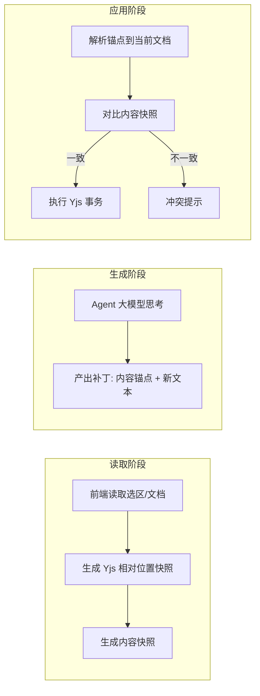
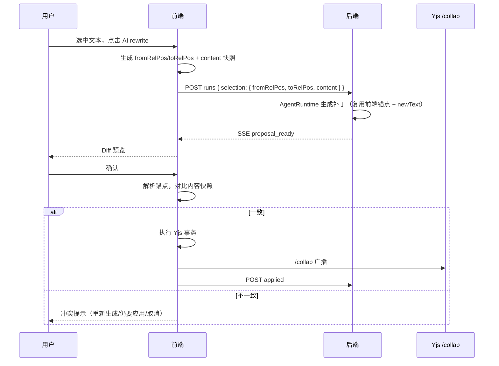

# Agent 文档编辑统一冲突处理设计

## 背景与目标

### 背景

现有选区改写 MVP 中，Agent 对文档的修改通过 Proposal 表落库，冲突检测依赖 `Node.version` 整数计数器。该设计在协作文档场景存在两个结构性问题：

1. `Node.version` 是服务端持久化批次计数器（2 秒防抖 / 满 50 次更新才 +1），与 Yjs 实时同步不同步。其他协作者的修改通过 WebSocket 实时可见，但 version 不会同步变化，导致"看到了修改但校验通过"的漏检。
2. 全文档粒度。任何位置的变化都会使 version 变化，Agent 只改一个选区也会被其他位置的修改阻塞，误报率高。

同时，Agent 的编辑形态不止选区改写，后续会扩展为读文档优化、创建文档、跨文档整理等。冲突处理需要从"选区特例"升级为"所有文档编辑形态的统一模型"。

### 目标

1. 冲突检测粒度收敛到"目标内容"，与文档其他位置的变化解耦。
2. 冲突检测基于 Yjs 相对位置与内容快照，不依赖 Node.version 整数。
3. Agent 写入通过前端 TipTap/Yjs 事务执行，与用户编辑完全同构，复用现有 /collab 同步通道。
4. 冲突处理采用"写时校验"，Agent 思考期间不干预、不打断、不锁定。
5. 冲突时提供用户可理解的交互，而非静默失败。

## 当前代码库现状

### 已有实现

| 模块          | 位置                                                   | 现状                                                                                                                                  |
| ------------- | ------------------------------------------------------ | ------------------------------------------------------------------------------------------------------------------------------------- |
| Agent 前端    | `apps/doc-web/src/agent/`                              | `AgentPatch{from,to,newText}` 绝对位置，`proposal-applier.ts` 三重校验（version/位置/文本），纯前端                                   |
| Agent 后端    | `apps/server/src/agent/`                               | Proposal CRUD，`confirmProposal` 用 `Node.version` 二次校验，SSE 事件流                                                               |
| Yjs 相对位置  | `node_modules/yjs`                                     | `createRelativePositionFromTypeIndex`、`relativePositionToJSON`、`createAbsolutePositionFromRelativePosition` 全套可用（yjs@13.6.31） |
| y-prosemirror | `node_modules/y-prosemirror`                           | `absolutePositionToRelativePosition` / `relativePositionToAbsolutePosition` 可用，实现 PM 位置与 Yjs 相对位置互转                     |
| RoomManager   | `apps/server/src/collab/room-manager.ts`               | `getOrCreateRoom` 返回持有权威 `Y.Doc` 的 Room，`persistNow` 私有；服务端未使用 `encodeStateVector`                                   |
| 前端 Yjs      | `apps/doc-web/src/pages/knowledge-base-view/index.tsx` | 前端持有 `ydoc = useMemo(() => new Y.Doc(), [nodeId])`，通过 WebsocketProvider 接入                                                   |

### 关键差距

1. `AgentPatch` 使用 TipTap 绝对位置，并发插入会导致位置漂移。
2. `AgentProposal.patch` 字段结构单一（单区间 replace），不支持多区间编辑。
3. 冲突交互是"直接报错 + 重新生成"，没有"仍要应用"的选项。
4. 后端 `confirmProposal` 无状态机 CAS 与过期校验，并发重复确认可穿透。

## 架构与技术设计

### 核心模型：内容寻址的写时校验

Agent 对文档的一切修改统一抽象为"针对读取时内容快照的补丁"。整个流程分为三个阶段：



关键决策：

1. **写时校验而非运行时打断**：Agent 思考期间文档任意变化，不干预、不 abort、不锁定。只有应用时才校验目标内容。
2. **前端 Yjs 事务写入**：补丁应用 = 一次 `editor.chain().insertContentAt()`，与用户编辑完全同构。CRDT 自动合并不重叠的并发修改，/collab 通道负责同步。
3. **双锚点定位**：用户选区用前端生成的 Yjs 相对位置（解析时自动跟随内容移动）；Agent 自主产出用内容锚点（原文片段，前端唯一匹配定位）。内容快照对比是冲突判断的唯一主依据。
4. **冲突 = 目标内容变化**：应用时对比当前内容与读取时快照。其他区域修改不构成冲突，只有目标区间内容变化才需要用户介入。

### 相对位置与内容快照生成

前端在发起 Agent run 时，将选区转换为 Yjs 相对位置并附带内容快照。转换必须经 y-prosemirror 辅助函数，直接对 XmlFragment 建相对位置会把 PM 绝对位置误当子节点索引（仓库已有正确先例：`remote-node-cursors.tsx:71-87`、`widget-node-view.tsx:30-33`）：

```ts
// 伪代码：选区转相对位置（依赖 ySyncPluginKey 的 binding.mapping）
import { absolutePositionToRelativePosition } from 'y-prosemirror';
import { ySyncPluginKey } from 'y-prosemirror';

const ystate = ySyncPluginKey.getState(editor.state);
const fromRel = absolutePositionToRelativePosition(from, ystate.type, ystate.binding.mapping);
const toRel = absolutePositionToRelativePosition(to, ystate.type, ystate.binding.mapping);

// 提交给后端
{
  selection: {
    fromRelPos: Y.relativePositionToJSON(fromRel),
    toRelPos: Y.relativePositionToJSON(toRel),
    content: textBetween(from, to, '\n')  // 用于 Diff 展示与校验
  }
}
```

块分隔符约定：快照生成与应用校验必须使用**同一文本变换** `textBetween(from, to, '\n')`。若快照不带分隔符而校验带 `'\n'`，跨段选区的 `selection.content` 与校验时 `current` 必然不等，导致未被他人修改也误报 modified（实测：两段文本区间上默认 `textBetween(1,8)` 返回无分隔符拼接，带 `'\n'` 才返回分段文本）。此约定同样约束内容锚点 `baseContent` 的块表示。

要点：

1. 相对位置必须在 **run 发起时刻** 由前端生成，因为只有前端持有 `Y.Doc` 与 ySyncPlugin binding。
2. `binding.mapping` 必须用 ySyncPlugin 的实时映射（随事务更新），不能快照。
3. Agent 侧只有文档文本（PM JSON），没有 Y.Doc，**不能**生成 Yjs 相对位置。这决定了锚点来源分工（见"补丁格式"）。

### 补丁格式

Agent 的 edit 定位采用**双锚点来源**，因为 Agent 侧没有 Y.Doc：

1. **前端锚点（相对位置）**：run 发起时前端为用户选区生成的 `fromRelPos/toRelPos`，Agent 改写选区时直接复用。
2. **内容锚点（baseContent）**：Agent 自主产出的多区间编辑（读文档优化等），Agent 只描述"要替换的原文片段 + 新文本"，前端应用时在最新文档中查找该片段定位。

```ts
interface AgentEdit {
  fromRelPos?: unknown; // 前端锚点（用户选区），优先级最高
  toRelPos?: unknown;
  baseContent: string; // 读取时该区间原文，既用于定位也用于校验
  newText: string;
}

interface AgentPatch {
  edits: AgentEdit[]; // 多区间；同一 proposal 内 edits 互不相交
}
```

约束：

- 同一 proposal 内 edits 互不相交（前端应用时强制校验，不满足则整体冲突）
- 改写路径下 `baseContent` 必须与 run 发起时前端快照 `selection.content` 逐字节一致（Agent 生成契约，mock 与提示词需遵守），否则未被他改也会误报 modified
- 内容锚点要求 `baseContent` 非空（空串会在任意位置匹配，违反唯一性）
- 纯插入（零长区间）只能走前端锚点路径

- 选区改写：`edits: [单条]`，带前端锚点
- 读文档后整篇优化：`edits: [多条]`，Agent 产出内容锚点，前端应用时唯一匹配定位（匹配失败或不唯一 → 冲突）
- 创建文档：`edits: []`，无冲突概念，走独立流程

### 应用阶段校验与执行

前端 `proposal-applier.ts` 演进为两步：先全部校验，再单事务应用。

```ts
function applyAgentProposal(editor, ystate, proposal): ApplyResult {
  // 第一步：全部校验并解析，不做任何修改
  const failures: ConflictEdit[] = [];
  const resolved: Array<{ edit: AgentEdit; range: { from: number; to: number } }> = [];

  for (const edit of proposal.patch.edits) {
    const range = resolveEditRange(editor, ystate, edit); // 见下，使用 ystate.doc
    if (range === null) {
      failures.push({ edit, reason: 'not_found' }); // 内容锚点找不到/相对位置整块被删
      continue;
    }
    const current = editor.state.doc.textBetween(range.from, range.to, '\n');
    if (current !== edit.baseContent) {
      failures.push({ edit, reason: 'modified' }); // 目标内容已被修改（主判断）
      continue;
    }
    resolved.push({ edit, range });
  }

  if (failures.length > 0) {
    return { status: 'conflict', failures };
  }

  // 第二步：按 from 降序排序后单事务应用
  // 先改后面的位置不影响前面的；同一 chain() 内所有命令共享一个事务
  // = 单 undo 步 = 单次 /collab 广播
  const ordered = [...resolved].sort((a, b) => b.range.from - a.range.from);
  // 强制 edits 互不相交：排序后相邻区间若相交则整体判冲突
  for (let i = 1; i < ordered.length; i++) {
    if (ordered[i].range.to > ordered[i - 1].range.from) {
      return {
        status: 'conflict',
        failures: ordered.slice(i - 1).map((item) => ({ edit: item.edit, reason: 'overlap' })),
      };
    }
  }
  const chain = editor.chain();
  for (const { edit, range } of ordered) {
    chain.insertContentAt({ from: range.from, to: range.to }, edit.newText);
  }
  chain.run();
  return { status: 'applied' };
}
```

`resolveEditRange` 按锚点来源分派（使用 `ystate.doc`，即 ySyncPlugin 上的 Y.Doc，避免引入第二个实例）：

1. **前端锚点**：`relativePositionToAbsolutePosition(ystate.doc, ystate.type, relPos, ystate.binding.mapping)`，解析越界时 clamp 到文档边界（复用 `remote-node-cursors.tsx:86` 的 clamp 先例）。
2. **内容锚点**：在最新文档中查找 `baseContent`，要求唯一匹配，否则返回 null。内容锚点的 `baseContent` 必须非空。

原子性：所有 edits 校验通过才应用。校验循环与应用循环之间无 await，避免状态在两次循环间变化。排序时顺带校验解析出的区间两两不相交（edits 互不相交不变式在此强制），相交则整体判冲突。

### 冲突交互

冲突时给用户三个选择，替代当前"直接 stale 报错"：

```text
┌─────────────────────────────────────────────┐
│  该区域已被其他协作者修改                     │
│                                              │
│  修改前: <Agent 读取时的内容>                 │
│  修改后: <当前实际内容>                       │
│  Agent 建议: <newText>                       │
│                                              │
│  [重新生成]  [仍要应用]  [取消]               │
└─────────────────────────────────────────────┘
```

- 重新生成：调 `markProposalStale`，用户重新发起 run
- 仍要应用：仅当**所有失败均为 `modified`** 时可用，跳过内容校验直接执行补丁（覆盖式），写入后 ack；存在任一 `not_found`/`overlap` 失败时无可用区间，不提供该选项
- 取消：调 `rejectProposal`

冲突语义统一为两种：

- `not_found`：内容锚点在最新文档中无法唯一匹配，或前端相对位置解析失效
- `modified`：定位成功但当前内容与 `baseContent` 不一致

删除语义说明：文本级删除（用户删掉选中文字）时相对位置解析结果通常**非 null**（解析到空段落起点），是否冲突由内容快照对比判定；只有整块节点被删（依赖 GC）才可能解析为 null。因此内容快照对比是唯一主判断，null 仅是附加信号。

## 数据流

### 选区改写（正常路径）



### 冲突校验点

| 校验点 | 位置 | 检查内容                                  |
| ------ | ---- | ----------------------------------------- |
| 应用前 | 前端 | 锚点解析 + 内容快照对比（主判断）         |
| 确认时 | 后端 | 权限、状态机 CAS、过期时间                |
| 兜底   | 后端 | `Node.version` 不再作为主判断，仅记录审计 |

信任边界声明：**前端是内容完整性的信任边界**。前端持有实时 Y.Doc 与 ySyncPlugin binding，是内容校验的唯一权威点；服务端 `RoomManager.room.ydoc` 虽也是权威文档且依赖 yjs，但 MVP 阶段不做服务端内容抽查，仅做权限与状态机校验（服务端抽查列为后续增强）。被篡改前端可伪造 APPLIED 状态，对 MVP 可接受。

## 数据模型演进

`AgentProposal` 表调整：

```prisma
model AgentProposal {
  id            String   @id @default(cuid())
  runId         String
  nodeId        String
  baseVersion   Int      // 保留，降级为审计字段，不再做主冲突判断
  patch         Json     // { edits: [{ fromRelPos?, toRelPos?, baseContent, newText }] }
  affectedRange Json?    // 保留，审计用
  status        AgentProposalStatus @default(PENDING)
  confirmedBy   String?
  confirmedAt   DateTime?
  appliedAt     DateTime?
  expiresAt     DateTime?
  createdAt     DateTime @default(now())
}
```

- `patch` 结构从单区间 replace 升级为多区间 edits
- `baseVersion` 保留但语义降级：仅用于审计与历史追溯

## 关键接口

### 前端

```ts
// agent.types.ts
interface AgentSelection {
  fromRelPos: unknown;
  toRelPos: unknown;
  content: string;
}

interface AgentProposal {
  proposalId: string;
  runId: string;
  nodeId: string;
  patch: AgentPatch; // { edits: AgentEdit[] }
}

// proposal-applier.ts
type ApplyResult = { status: 'applied' } | { status: 'conflict'; failures: ConflictEdit[] };

type ConflictReason = 'not_found' | 'modified' | 'overlap';
interface ConflictEdit {
  edit: AgentEdit;
  reason: ConflictReason;
}
```

接口迁移清单（涉及现有文件）：

- `StartAgentRunInput`（agent.types.ts）：`selection{from,to,text}` 升级为 `selection{fromRelPos,toRelPos,content}`；`nodeBaseVersion` 继续提交，降级为审计用途（后端不再据此拒绝 run；若需落库须在 `AgentRun` 增加字段）
- `agent.api.ts`：`POST runs` 请求体随 selection 结构同步升级
- `propose_document_patch` 工具（agent 后端 tools/）：inputSchema 从 `{from,to,newText}` 升级为 `{baseContent,newText}`（可含多编辑），Agent 产出补丁契约（含 `baseContent` 与 `selection.content` 逐字节一致）在此强制
- `AgentProposal.patch`：单区间 replace → edits 数组

### 后端

后端确认与状态迁移必须原子化，防止并发重复确认：

```ts
// 原子迁移：只有 PENDING 且未过期才能确认
const updated = await prisma.agentProposal.updateMany({
  where: { id: proposalId, status: 'PENDING', expiresAt: { gt: new Date() } },
  data: { status: 'APPLYING', confirmedBy: userId, confirmedAt: new Date() },
});
if (updated.count === 0) {
  // 已确认过 / 已过期 / 不存在 → 拒绝
}
```

后端保留：权限校验（owner）、状态机 CAS（仅 PENDING 可确认）、过期校验（`expiresAt`）。不做内容校验（见信任边界声明）。`baseVersion` 审计语义：保留生成时的 `Node.version`，不在状态迁移中覆写；如需记录应用时的版本，另加字段，避免丢失"生成时版本"。

## 错误处理、兼容性与边界情况

### 边界情况

| 场景                                | 处理                                                                                                                    |
| ----------------------------------- | ----------------------------------------------------------------------------------------------------------------------- |
| 目标内容被删除（整块节点，GC 生效） | 相对位置解析返回 null，判定 not_found                                                                                   |
| 目标内容被部分修改/删除文本         | 内容快照不匹配，判定 modified（主路径）                                                                                 |
| 目标内容未变，其他位置被改          | 相对位置自动跟随，内容快照一致，正常应用                                                                                |
| 并发插入到目标区间内部              | 相对位置 assoc 决定锚点，可能判定 modified，由用户裁决                                                                  |
| 多区间部分冲突                      | 原子性：全部通过才应用，部分冲突则整体冲突提示                                                                          |
| 内容锚点匹配不唯一                  | 判定 not_found，提示重新生成                                                                                            |
| 相对位置解析越界                    | clamp 到文档边界（复用 remote-node-cursors clamp 先例）                                                                 |
| 零长区间（from === to，纯插入）     | 仅前端锚点路径支持，按插入处理；内容锚点要求 baseContent 非空，不适用                                                   |
| Proposal 过期（10 分钟）            | 后端确认时拒绝（CAS 含 expiresAt），前端提示重新生成                                                                    |
| 并发重复确认                        | 后端 CAS（仅 PENDING 可确认）防止；残余竞态（双端各自本地校验通过后都应用）显式接受，Yjs 合并产生重复插入，作为已知限制 |
| 创建文档                            | 无冲突概念，走独立 `create_document` 流程                                                                               |

### 编辑历史（undo/redo）

- Agent 应用为**单事务**，即单 undo 步，用户一次撤销可回退整个 Agent 修改
- 当前编辑器 `StarterKit.configure({ history: false })` 与 Collaboration 并存，undo/redo 语义沿用现有协作历史机制，不额外引入

### 兼容性

- 旧 `AgentPatch`（单区间 from/to/newText）不再使用，迁移为 `edits` 数组
- `AgentProposal.baseVersion` 字段保留，不删表，只降级语义：保留生成时的 `Node.version` 供审计追溯，不覆写
- SSE 事件 `proposal_ready` 的 payload 结构随 patch 升级
- 前端 `StartAgentRunInput` 迁移：`selection{from,to,text}` 升级为 `selection{fromRelPos,toRelPos,content}`，`nodeBaseVersion` 继续随 run 提交（降级为审计用途，后端不再据此拒绝 run）
- 后端 `POST runs` 请求体同步升级 selection 结构
- `create_document` 不产生 `AgentProposal`/patch，是独立流程，不在本设计范围内

## 测试策略

1. **单元测试（proposal-applier）**：前端锚点解析、内容锚点唯一匹配、内容快照对比、not_found/modified/overlap 判定、原子性（全部通过才应用）、单事务（单 undo 步）、跨段选区块分隔符一致性（快照与校验同用 `'\n'` 变换）、零长插入、越界 clamp、edits 相交拒绝
2. **单元测试（mock 补丁生成）**：Agent 补丁格式符合 edits 结构，单编辑/多编辑两种形态，`baseContent` 与 `selection.content` 逐字节一致
3. **集成测试**：
   - B 用户整段删除目标内容 → not_found 路径
   - B 用户段内改字 → modified 路径（验证不依赖 null 机制）
   - B 用户改其他段 → 正常应用
   - 双浏览器并发确认同一 Proposal → 后端 CAS 只放行一个
   - "仍要应用"强制路径：仅 modified 可用，跳过内容校验后应用
4. **回归测试**：现有选区改写链路（确认/拒绝/stale）行为不回归

## 明确不做的内容

1. 不做文档锁、选区软锁
2. 不做思考期间监听打断（写时校验已覆盖核心诉求）
3. 不做服务端 RoomManager 直写（写入统一走前端 Yjs 事务）
4. 不做多端同时确认同一 Proposal 的合并（单端确认 + 后端 CAS；残余双端同时应用的竞态显式接受为已知限制）
5. 不做 Yjs state vector 全文档比对（相对位置 + 内容快照已足够精确，YAGNI）
6. 不做服务端内容抽查（信任边界在前端，服务端抽查列为后续增强）
7. 不做跨文档编辑（当前 `AgentProposal` 按单文档 `nodeId` 建模，跨文档整理列为后续形态）
