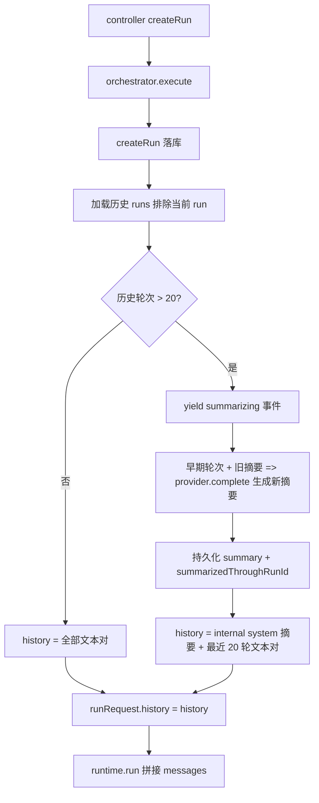
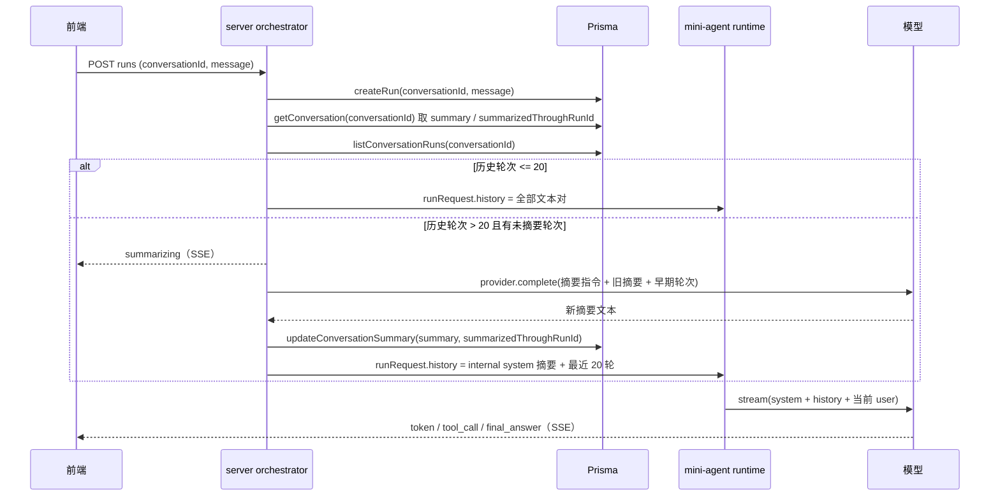

# Agent 对话历史消息接入与滚动摘要

## 背景与目标

### 背景

当前 `AgentRuntime` 每次 run 构造的 `messages` 只包含系统提示词和当前用户消息（`packages/mini-agent/src/agent-runtime.ts:57-60`），`RunRequest.conversationId` 已存在但从未被用于加载历史（`apps/server/src/agent/agent-orchestrator.ts:116-125`）。模型无法感知同一会话之前的对话，多轮对话中"上一轮说过什么"会丢失。

数据侧已有完整支撑：`AgentRun` 表每轮存有 `message`（用户输入，纯文本、不含文档快照）和 `finalAnswer`（助手最终回答）；前端已通过 `listRuns` + `rebuildHistory` 重建历史气泡展示（`apps/doc-web/src/components/agent-workspace/index.tsx:47-80`）。

### 目标

1. server 从 `AgentRun` 重建历史对话（每轮一条 user 消息 + 一条 assistant 消息的文本对），通过 `RunRequest` 新增的 `history` 字段注入 mini-agent，使模型具备会话内上下文。
2. 历史轮次少于或等于 20 轮时全量重放；超过 20 轮时，最近 20 轮保留原文，更早轮次自动压缩为滚动摘要，摘要持久化到 `AgentConversation` 表。
3. 摘要属于内部上下文，带 `internal` 标识，不展示到前端；组织上下文时摘要位于系统提示词之后、最近轮次原文之前。
4. 摘要生成期间，前端展示"总结对话内容中"过程提示（新 SSE 事件 `summarizing`），摘要正文不展示。

## 当前代码库现状

| 模块                | 位置                                                                                  | 现状                                                                                 |
| ------------------- | ------------------------------------------------------------------------------------- | ------------------------------------------------------------------------------------ |
| mini-agent 消息构造 | `packages/mini-agent/src/agent-runtime.ts:57-60`                                      | `messages = [system, user]`，无历史                                                  |
| mini-agent 类型     | `packages/mini-agent/src/types.ts:77-82`（Message）、`types.ts:119-126`（RunRequest） | `Message` 无 internal 字段，`RunRequest` 无 history 字段                             |
| mini-agent 模型接口 | `packages/mini-agent/src/types.ts:67-69`                                              | `ModelProvider` 仅 `stream()`，无非流式补全                                          |
| server 编排         | `apps/server/src/agent/agent-orchestrator.ts:51-204`                                  | `execute()` 中 createRun 后直接 `runtime.run(runRequest)`                            |
| server 存储         | `apps/server/src/agent/agent.service.ts:62-90`                                        | `getConversation` / `listConversationRuns` 已存在，无摘要读写                        |
| 数据模型            | `apps/server/prisma/schema.prisma:232-295`                                            | `AgentConversation`（无 summary 字段）、`AgentRun`（message/finalAnswer）            |
| 前端展示            | `apps/doc-web/src/components/agent-workspace/index.tsx:47-80`                         | 用 `listRuns` 重建气泡，`ChatMessage.role` 仅 user/assistant，不渲染 LLM 侧 messages |
| 迁移惯例            | `apps/server/prisma/migrations/`                                                      | `YYYYMMDDHHMMSS_snake_case/migration.sql`                                            |

### 关键差距

- `AgentRun.message` 只存用户原始输入，`buildUserMessage` 内拼装的文档快照不持久化，因此从历史重建的 user 消息是干净的用户文本，无过期快照问题。
- 前端展示链路（listRuns）与 LLM 上下文链路（messages）完全分离，摘要以 `internal` 标识注入 LLM 上下文不会泄漏到前端，前端无需改动。

## 架构与技术设计

### 整体思路

历史消息在 server 侧从 `AgentRun` 重建并注入，mini-agent 保持通用包边界（不依赖存储）。摘要生成复用 `ModelProvider`，通过新增可选非流式方法 `complete?` 实现。



### mini-agent 层变更

`Message` 增加 `internal?: boolean`：仅表达"该消息不用于前端展示"的 server/mini-agent 侧注解，不影响推理语义。provider 序列化时剥离该字段（如 `OpenAICompatibleModelProvider.toOpenAIMessages` 只映射 role/content/toolCallId/toolCalls），不发送给模型。

```ts
export interface Message {
  role: MessageRole;
  content: string;
  toolCallId?: string;
  toolCalls?: ToolCall[];
  /** 内部消息（如滚动摘要），不用于前端展示。 */
  internal?: boolean;
}

export interface RunRequest {
  runId?: string;
  conversationId: string;
  userMessage: string;
  context: RunContext;
  tools: AgentTool[];
  budget?: Partial<RunBudget>;
  /** 历史对话消息（含可选的内部摘要消息），排在系统提示词之后、当前用户消息之前。 */
  history?: Message[];
}
```

`ModelProvider` 增加可选非流式补全方法，用于滚动摘要等一次性文本生成；未实现时调用方需降级。

```ts
export interface ModelProvider {
  stream(request: ModelRequest): AsyncIterable<ModelEvent>;
  /** 非流式补全，用于滚动摘要等一次性文本生成。实现方可选。 */
  complete?(request: {
    messages: Message[];
    maxTokens?: number;
    signal?: AbortSignal;
  }): Promise<string>;
}
```

`AgentRuntime.run` 的 messages 构造改为在系统提示词之后插入历史：

```ts
const messages: Message[] = [
  { role: 'system', content: SYSTEM_PROMPT },
  ...(request.history ?? []),
  { role: 'user', content: this.buildUserMessage(request) },
];
```

provider 实现：`MockModelProvider.complete?` 返回固定摘要文本（如"这是一段历史对话摘要。"），保证 mock 模式下摘要路径可跑通；`OpenAICompatibleModelProvider.complete?` 用 `client.chat.completions.create({ stream: false })` 实现。

### 存储层变更

`AgentConversation` 新增两个字段，滚动摘要持久化：

```prisma
model AgentConversation {
  // 既有字段不变
  summary               String? // 滚动摘要文本，内部上下文，不展示给前端
  summarizedThroughRunId String? // 摘要覆盖到的最后一个 run id
}
```

`AgentService` 新增 `updateConversationSummary(conversationId, summary, summarizedThroughRunId)`。

### 编排层变更（server）

`AgentOrchestrator.execute` 在 createRun 之后、构建 runRequest 之前插入历史构建步骤。插入点明确为 `preparing_context` 事件之后、run 状态更新为 `REASONING` 之前，避免第 21 轮起摘要生成（一次非流式模型调用）期间前端无任何 SSE 事件反馈：

1. `getConversation(conversationId)` 读取 `summary` 与 `summarizedThroughRunId`。
2. `listConversationRuns(conversationId)` 按 createdAt 升序取全部 run，过滤掉当前 run.id。
3. 每轮 run 生成文本对：user 消息用 `run.message`，assistant 消息用 `run.finalAnswer`；`finalAnswer` 为空的失败轮跳过。
4. 若文本对数 <= 20：`history = 全部文本对`。
5. 若文本对数 > 20：先 `yield { type: 'summarizing', runId }`（新 SSE 事件，前端据此展示"总结对话内容中"）。早期轮次（index < length - 20 的部分）中，以 `summarizedThroughRunId` 在升序 run 数组中的位置为界，取其后的尚未摘要轮次；若存在，将"旧摘要（如有）+ 未摘要轮次文本对"交给 `provider.complete`（system 提示词为摘要压缩指令），得到新摘要后持久化，`summarizedThroughRunId` 更新为最后一个被摘要的 run.id。`history = [internal system 摘要消息] + 最近 20 轮文本对`。
6. 摘要生成失败时降级：丢弃早期轮次，仅重放最近 20 轮，不阻塞本次 run。

## 数据流



## 关键接口

### 后端

- `packages/mini-agent/src/types.ts`：`Message.internal?`、`RunRequest.history?`、`ModelProvider.complete?`
- `packages/mini-agent/src/agent-runtime.ts`：messages 拼接插入 `request.history`
- `packages/mini-agent/src/mock-provider.ts`、`openai-compatible-provider.ts`：实现 `complete?`
- `apps/server/prisma/schema.prisma`：`AgentConversation.summary`、`AgentConversation.summarizedThroughRunId`，新增一条 migration
- `apps/server/src/agent/agent.service.ts`：`updateConversationSummary`
- `apps/server/src/agent/agent-orchestrator.ts`：历史构建 + 摘要生成逻辑（建议抽为私有方法 `buildHistory(runs, conversation, provider)`）；`SseAgentEvent` 联合类型增加 `{ type: 'summarizing'; runId: string }`

### 前端

改动很小，仅状态提示，不渲染摘要正文：

- `apps/doc-web/src/agent/agent.types.ts`：`AgentEvent` 联合类型增加 `summarizing` 分支
- `apps/doc-web/src/components/agent-workspace/index.tsx`：`onEvent` 增加 `summarizing` case，将当前 assistant 消息的 `content` 置为"正在总结对话内容中..."，`status` 保持 `streaming`（复用既有打字机光标），首条 `token` 事件到达后自然被真实回答覆盖

历史展示继续走 `listRuns`，摘要不进入 `RunRecord`，`ChatMessage.role` 仅 user/assistant，摘要正文不渲染。

## 错误处理、兼容性与边界情况

| 场景                                           | 处理                                                                                                                          |
| ---------------------------------------------- | ----------------------------------------------------------------------------------------------------------------------------- |
| 历史轮次 <= 20                                 | 全量重放文本对，不生成摘要                                                                                                    |
| 历史轮次 > 20                                  | 早期轮次压缩为摘要，最近 20 轮保留原文                                                                                        |
| 摘要生成异常（provider.complete 抛错或未实现） | 降级：丢弃早期轮次，仅重放最近 20 轮，run 正常继续；已发出的 summarizing 提示会被后续 token 覆盖                              |
| 失败轮（finalAnswer 为空）                     | 跳过，不进入历史文本对                                                                                                        |
| mock provider                                  | `complete?` 返回固定摘要文本，summarizing 事件同样触发，全链路可跑通                                                          |
| 摘要不泄漏到前端                               | 摘要正文仅存在于 `Message`（LLM 侧契约）与 `AgentConversation.summary`，前端只消费 summarizing 事件做过程提示，不接触摘要正文 |
| 并发 run 同时触发摘要                          | 摘要为最后写入，可能覆盖；demo 场景可接受，不引入锁                                                                           |
| 摘要 prompt 输出含编造内容                     | 摘要指令明确"不编造新内容"；模型层兜底，demo 可接受                                                                           |
| 历史消息总长度超模型窗口                       | 20 轮上限 + 摘要压缩已控制规模；不做 token 级截断                                                                             |

## 测试策略

1. mini-agent 单测：传入 `request.history` 时，发送给 provider 的 messages 顺序为 system、history、当前 user。
2. mini-agent 单测：`internal: true` 的摘要消息原样传给 provider，不因 internal 被剔除。
3. server 单测：`buildHistory` 在历史 1 轮、恰好 20 轮、21 轮（触发摘要）三种规模下输出正确。
4. server 单测：摘要生成成功后 `summary` 与 `summarizedThroughRunId` 持久化；`provider.complete` 抛错时降级为仅最近 20 轮。
5. 前端单测或手动验证：收到 `summarizing` 事件后 assistant 气泡展示"正在总结对话内容中..."，首条 token 到达后内容被真实回答覆盖。
6. 手动验证：mock 模式下连续多轮对话，第 21 轮起上下文包含摘要与最近轮次；切换会话后历史仍可正确重建。

## 明确不做的内容

1. 不做跨会话上下文（摘要与会话历史严格绑定 conversationId）。
2. 不做前端摘要正文展示，仅展示"总结对话内容中"过程提示（摘要正文为内部上下文）。
3. 不做异步摘要任务，首次触发摘要的那次 run 会额外等待一次模型调用。
4. 不做按 token 数截断，仅按轮数（20 轮）控制。
5. 不修复 `agent-chat-panel` 设计文档与现有实现中历史 proposal 仍可操作的问题，属既有范围外。
