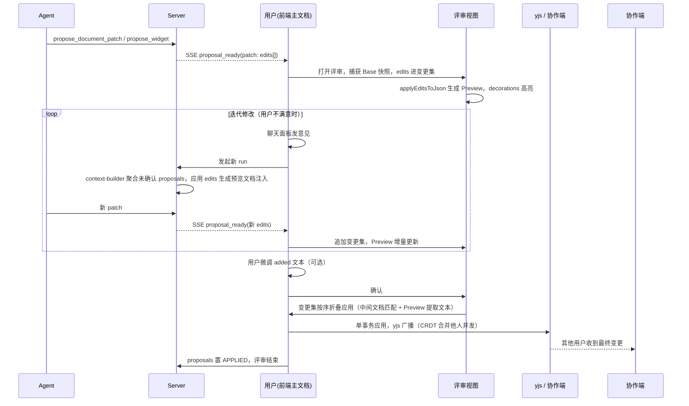

# Agent 文档变更评审视图（agent-inline-diff）设计文档

## 1. 背景与目标

### 1.1 背景

现有 Agent 文档修改提案（proposal）在侧边聊天面板（agent-workspace）中以 JSON diff 卡片展示，可读性差，且文档修改涉及多个位置时难以完整呈现。提案确认后由 `proposal-applier` 应用到协同文档。

### 1.2 目标

- 提案改为在**客户端本地的专用评审视图**中展示，形态为一个完整文档（Preview），改动在原位置以合并 diff 展示（红绿高亮），可切换查看"变更前快照"。
- 评审是客户端本地行为：不写入协同文档、不同步给其他协作者，其他用户全程无感知。
- **变更累积**：一次评审期内（从提案产生到用户确认/拒绝），同一会话的多次 run 产生的 edits 累积成变更集，评审视图持续追加展示，而不是每轮一个独立提案卡片。
- **迭代修改**：用户对当前 diff 不满意时，在聊天面板给出意见，AI 基于"当前预览文档（含已累积变更）+ 意见"继续生成新 patch，追加进当前评审。
- 评审视图内仅变更区域可编辑（added 文本可直接微调），确认后变更集按序应用到协同文档，经 yjs/CRDT 合并他人并发编辑。
- 覆盖文本替换与 widget 插入两类变更（widget 插入来自 agent-widget-runtime 设计）。

### 1.3 关键设计决策

| 决策点       | 选择                                                                                  | 理由                                                    |
| ------------ | ------------------------------------------------------------------------------------- | ------------------------------------------------------- |
| 评审视图形态 | 一个完整文档（Preview 为主 + 红绿高亮），可切换到 Base 快照                           | 用户确认，改动在原位置展示，Comate 风格                 |
| 评审视图内容 | 独立编辑器实例，内容为 Base 应用变更集后的文档（added 为真实文本）                    | removed 是装饰叠加，added 是真实文档数据，天然可编辑    |
| 可编辑范围   | 仅变更区域（added 文本 / widget 节点）可编辑，其余只读                                | 用户确认，edit 粒度应用，避免整篇 diff 回写的复杂度     |
| 变更集范围   | 一次评审期：同一会话的未确认 proposals 的 edits 累积；确认/拒绝后评审结束，变更集清空 | 用户确认，评审期内持续累积，确认后是新评审              |
| 迭代修改入口 | 意见走聊天面板，新 run 上下文由服务端注入"应用变更集后的预览文档"                     | 用户确认，复用现有对话机制，评审视图不耦合 run 生命周期 |
| 锚点         | 沿用 baseContent / newText 内容锚点，relPos 不作为硬需求                              | 用户判断，避免服务端工具改造；冲突检测兜底              |
| 锁定语义     | 评审期间不锁定任何人的编辑，主编辑器协同照常                                          | 评审是本地行为，确认时冲突检测处理并发                  |

## 2. 当前代码库现状

### 2.1 提案展示

- `apps/doc-web/src/components/agent-workspace/index.tsx`：`renderProposal`（L411-464）在聊天区渲染 diff 卡片（removedLine 红底 / addedLine 绿底）；`confirmProposal`（L388-400）先调服务端 CAS 再 apply；`rejectProposal`（L402-409）；冲突弹窗（L340-385）。
- 红/绿配色样式（`index.module.less` L326-354）可复用到评审视图高亮。
- `toViewProposal`（L39-49）为每个 edit 生成稳定 `editId`（`{proposalId}-{index}`）。

### 2.2 编辑器能力

- `knowledge-base-view/index.tsx`：主编辑器实例按 `editable` 变化整体重建（L684），`setEditable` 未使用；VersionPreviewModal（L1808-1857）已有"独立只读编辑器实例"先例。
- ProseMirror decorations 项目零使用，但依赖已具备：`Decoration` / `DecorationSet` 从 `@tiptap/pm/view`、`@tiptap/pm/state` 导入；挂载方式为自定义 Extension 的 `addProseMirrorPlugins()` 返回带 `props.decorations` / `props.editable` 的 Plugin。

### 2.3 锚点与冲突

- `proposal-applier.ts`：`resolveEditRange`（L31-58）优先 relPos，回退 `findUniqueTextRange`（L64-89，单 text node 内唯一子串匹配）；应用前做内容快照对比（L115-121），不一致标记 `modified`；按 from 降序单事务 `insertContentAt`（L139-143）。
- 服务端 patch 只存 `baseContent` + `newText`（`propose-document-patch.tool.ts` L47-59），无 relPos。

## 3. 架构与技术设计

### 3.1 评审视图模型

```mermaid
flowchart TD
  subgraph 评审视图（客户端本地覆盖层）
    BASE[Base 编辑器：变更前快照，只读]
    PREV[Preview 编辑器：应用变更集后的文档]
    TOOLBAR[操作条：确认全部 / 拒绝 / 切换快照]
  end
  SSE[proposal_ready] -->|追加到变更集| CS[变更集 changeset]
  CS -->|重新生成| PREV
  BASE -->|切换查看| TOOLBAR
  PREV -->|用户微调 added 文本| PREV
  TOOLBAR -->|确认| APPLY[按序应用到协同文档]
  APPLY --> Y[(yjs 同步)]
  TOOLBAR -->|拒绝| REJ[变更集清空，评审结束]
  CHAT[聊天面板用户意见] -->|新 run| SSE
```

- **评审会话**：一次评审从首个 proposal_ready 到达开始，到用户确认或拒绝结束。评审会话期间，同一会话（conversation）后续 run 产生的 proposal 全部聚合进当前评审，edits 累积成变更集；确认/拒绝后评审结束，变更集清空，后续 run 属于新评审。
- **变更集口径（以服务端为权威）**：变更集只包含该 conversation 下 `status = PENDING` 且未过期的 proposals 的 edits。`proposal_ready` 到达即追加（与评审视图开关无关，视图关闭期间累积的变更在重新打开时可见）；提案过期（10 分钟）后从变更集剔除并显示过期态，确认时跳过。
- **评审会话恢复**：评审会话为前端内存态；页面刷新或关闭后重新打开时，从服务端拉取该 conversation 的未确认 proposals（PENDING 未过期，现有 `listConversationRuns` 已返回 patch）重建变更集并重新生成 Preview，变更累积不丢失。
- 提案到达（proposal_ready）后，前端自动打开评审视图（Drawer 或全屏覆盖层），主编辑器保持可编辑、协同照常，互不干扰。
- 评审视图持有两个独立 `useEditor` 实例：
  - **Base 编辑器**：`editable: false`，内容为评审会话开始时的文档快照（`editor.getJSON()` 复制），用于切换查看变更前原文。
  - **Preview 编辑器**：内容为 Base 应用变更集后的文档，变更区域高亮，仅变更区域可编辑。
- 变更集数据结构：`ChangeSet = Array<{ proposalId, edits: AgentEdit[] }>`，按到达顺序排列；`editId` 由 `{proposalId}-{index}` 生成（复用 `toViewProposal` 语义），全局唯一。

### 3.2 Preview 内容生成（变更集增量应用）

`applyEditsToJson(baseJson, edits) → { previewJson, editRanges }`：

- 在目标 JSON（Base 或当前 Preview）上按 `baseContent` 唯一匹配定位每个 edit 的文本范围（复用 `findUniqueTextRange` 的匹配语义，在 JSON 树中实现，匹配时忽略 `reviewAdd` mark 只看文本）。
- 按位置从后往前应用（避免位置漂移）：
  - 文本替换：将匹配文本替换为 `newText`，并给新增文本包裹 `reviewAdd` mark（attrs: `editId`），用于高亮与后续提取。
  - widget 插入（`kind: 'widget'`）：在 `insertAfter` 锚点文本之后插入 `{ type: 'widget', attrs: { widgetType, props } }` 节点，记录该节点位置用于高亮。
- `editRanges` 记录每个 editId 在 Preview 文档中的位置（added 文本范围 / widget 节点位置），供 decorations 与可编辑判断使用。
- **增量更新**：新 proposal 到达时，变更集追加其 edits，对"当前 Preview 内容"应用新 edits 生成新 Preview（新 edit 的 baseContent 在已含旧变更的预览内容上匹配，语义是"在现有修改基础上继续改"）。已有 editId 的 mark 与位置保持不变。
- 匹配失败（baseContent 找不到或不唯一）的 edit 标记为 `not_found` / `ambiguous`，评审视图给出该 edit 的失败提示，确认时按冲突语义处理。

### 3.3 变更高亮与可编辑控制

Preview 编辑器挂自定义 Extension（如 `ReviewHighlightExtension`）：

- `addProseMirrorPlugins()` 返回 Plugin，提供：
  - `props.decorations(state)`：`DecorationSet`，为 `reviewAdd` mark 加绿底 inline decoration（复用现有 `#f0fff4` 配色）；为 removed 区域在替换位置前叠加红底 widget decoration（`Deco.widget`，内容为被删文本 `baseContent`，复用 `#fff1f0` 配色）；widget 节点位置加边框高亮 node decoration。
  - `props.editable(state)`：当前 `selection.from/to` 完全落在某个 `reviewAdd` mark 范围内或 widget 节点内时返回 true，否则 false。实现"仅变更区域可编辑"。
  - 实现细节：editable 由选区变更驱动重算（prosemirror-view 每次 dispatch 后重算 `view.editable`），但翻转时不自动聚焦，需在可编辑态翻转时显式 `editor.commands.focus()`，否则首次点击进入变更区域可能需点第二次才能输入。
  - 光标恰在 mark 起点/终点时（`marksAt` 两侧不一致），判定为可编辑，允许在 added 文本两端继续输入且新输入继承 mark（保持该 edit 归属）。
- 切换"变更前快照"：隐藏 Preview、显示 Base 编辑器（只读），不销毁 Preview 实例，保留用户微调内容。

### 3.4 确认应用（变更集按序折叠应用）

- 确认时把变更集内所有 proposal 的 edits 按到达顺序**折叠应用**到协同文档，单事务完成：
  1. 初始化"中间文档"为当前协同文档。
  2. 对变更集每个 edit 按序处理：
     - 从 Preview 编辑器读取该 editId 对应 `reviewAdd` mark 的当前文本（用户可能已微调）；若 mark 已被用户删空，视为替换为空（删除）。**边界兜底**：用户整段删空后重打的文本不带 mark（ProseMirror 删空后 marksAt 由相邻文本决定），此时对比该区域（相对 baseContent）确有用户文本则以其为准，避免丢弃用户重打内容。widget edit 通过 Preview 中 widget 节点的临时 attr `reviewEditId` 定位。
     - 在"中间文档"上定位该 edit 的 baseContent / insertAfter（`findUniqueTextRange` 语义）。后续 edit 的 baseContent 基于预览文档（含前序变更与用户微调），因此在中间文档（已应用前序 edit 的提取文本）上匹配成立，前提是变更集内 edit 区域互不重叠。
     - **锚点完好性校验**：中间文档定位处的旧文本与 `baseContent` 比对，不一致（他人并发修改 / 锚点消失 / 非唯一）标记 `modified` / `not_found` / `ambiguous`。提取文本（Preview 中该 edit 的当前文本）是待插入载荷，不作为比对基线。
  3. 全部校验通过后，按定位结果 from 降序单事务 `insertContentAt` 应用到协同文档。
- 应用成功后：关闭评审视图，变更集内所有 proposal 置 APPLIED（逐个走现有 applied 接口或批量），评审结束。
- 存在失败（not_found / modified / ambiguous，含 edit 区域重叠）时复用现有冲突弹窗：全 `modified` 可强制应用，其余 Regenerate / Cancel。
- 拒绝：关闭评审视图，变更集内所有 proposal 调现有 `rejectProposal`，变更集清空，评审结束。
- widget edit 应用细节见 agent-widget-runtime 设计（组件激活、sandbox 渲染），评审视图只负责插入占位展示与确认后的插入动作。

### 3.5 与聊天面板的关系（迭代修改）

- 聊天区保留对话流与提案状态标识（Applied / Rejected），移除内嵌 diff 卡片，diff 主体迁移到评审视图。
- 聊天区的确认 / 拒绝按钮不再需要，操作入口移到评审视图操作条；聊天消息点击"查看变更"重新打开评审视图（评审期间未关闭时）。
- **迭代修改机制**：评审期间用户对当前 diff 不满意时，在聊天面板发消息给出意见（普通对话，无需额外交互）：
  1. 前端照常发起新 run（复用现有对话机制，同一 conversation）。
  2. 服务端 `context-builder` 注入文档内容时，**聚合该 conversation 下 `status = PENDING` 且未过期的 proposals** 的 edits，先应用生成"预览文档"再注入 prompt，并附注当前已有 N 处未确认修改。LLM 基于"当前修改 + 用户意见"继续生成新 patch。注意服务端预览基于原始 newText（用户本地微调对服务端不可见），LLM 新 patch 的 baseContent 可能在前端预览上匹配失败，按 6. 的预览语义增量应用兜底。
  3. 新 patch 的 `proposal_ready` 到达时（属于同一 conversation），edits 追加进变更集（与评审视图开关无关），Preview 增量更新（见 3.2）。评审视图关闭期间累积的变更在重新打开时可见。
- 服务端需要一份与前端 `applyEditsToJson` 同语义的 JSON 级 edits 应用实现（供 context-builder 生成预览文档），两处逻辑保持一致；可在 packages 中抽共享 util，实施阶段定。
- 评审期间主编辑器协同照常，他人并发编辑由确认时的冲突检测兜底。

### 3.6 widget 插入在评审视图中的展示

- 评审预览中 widget 插入位置显示高亮占位块"新增组件：{title}"（组件未激活，不加载真实组件，避免评审期间执行代码）。
- 确认应用后，主文档 widget 节点正常走 agent-widget-runtime 的加载渲染链路。

## 4. 数据流



## 5. 关键接口与数据结构

```ts
// 评审会话状态（前端内存态，可从服务端未确认 proposals 重建）
interface ReviewSession {
  conversationId: string;
  changeSet: Array<{ proposalId: string; edits: AgentEdit[] }>; // 按到达顺序，仅 PENDING 未过期
  baseJson: JSONContent; // 评审开始时的文档快照
  previewJson: JSONContent; // 应用变更集后的文档
  editRanges: Map<editId, { from: number; to: number }>;
}

// Preview 生成结果（单次 applyEditsToJson 的产物）
interface ReviewPreview {
  previewJson: JSONContent;
  edits: Array<{
    editId: string;
    kind: 'text' | 'widget';
    status: 'ok' | 'not_found' | 'ambiguous';
    baseContent: string; // 文本替换：原文本；widget：锚点文本
    newText?: string; // 原始提案文本（added 初始值）
    widget?: { widgetType: string; props: Record<string, unknown>; title: string };
    from?: number; // Preview 中 edit 区域位置（decorations / 提取用）
    to?: number;
  }>;
}

// ReviewHighlightExtension：decorations + editable 的 ProseMirror Plugin
// reviewAdd mark：attrs { editId }，包裹 added 文本
```

- 服务端接口与提案状态机复用现有（confirm / reject / applied），评审期聚合与批量置态可在现有接口上循环或增加批量变体，实施阶段定。
- `context-builder` 新增：聚合同一 conversation 的未确认 proposals edits，应用生成预览文档注入（见 3.5）。
- `proposal-applier` 应用逻辑扩展：支持变更集按序折叠应用（中间文档匹配 + Preview 提取文本），与前端 `applyEditsToJson` 保持同一匹配语义。

## 6. 错误处理、兼容性与边界情况

| 场景                                        | 处理                                                                                                                                              |
| ------------------------------------------- | ------------------------------------------------------------------------------------------------------------------------------------------------- |
| baseContent 匹配失败 / 不唯一（评审生成期） | 该 edit 标记 not_found / ambiguous，高亮为失败态，确认时走冲突弹窗                                                                                |
| 变更集内 edit 区域重叠                      | 确认应用时标记冲突（后续 edit 在中间文档匹配失败或与已应用区域重叠），走冲突弹窗                                                                  |
| 评审期间他人修改目标区域                    | 确认时锚点完好性校验（旧文本 vs baseContent）标记 modified，现有冲突弹窗（强制 / Regenerate / Cancel）                                            |
| 确认时锚点消失 / 非唯一                     | 标记 not_found / ambiguous，走冲突弹窗                                                                                                            |
| 提案过期（10 分钟，评审期间）               | 从变更集剔除并显示过期态，确认时跳过；用户可要求 Agent 重新生成                                                                                   |
| 评审期间他人编辑文档其他区域                | 无冲突，CRDT 天然合并，确认应用不影响                                                                                                             |
| 用户删空 added 区域                         | 视为替换为空（删除语义），确认时正常应用                                                                                                          |
| 用户将光标移到非变更区域                    | props.editable 返回 false，只读                                                                                                                   |
| 迭代 run 的 patch 基于旧内容生成            | 其 baseContent 在预览文档（含前序变更）上匹配，评审视图按预览语义增量应用；服务端预览用原始 newText，LLM 锚点在前端预览可能 not_found，按预览兜底 |
| 旧提案（无 widget edit、无 reviewAdd）      | 走同一评审视图与变更集机制，行为一致                                                                                                              |
| 只读模式（非编辑态）触发评审                | 评审视图独立于主编辑器可用；确认应用需编辑权限，无权限时仅展示                                                                                    |
| 评审视图关闭 / 页面刷新（未确认）           | 提案保持 PENDING；重开时从服务端拉取未确认 proposals 重建变更集与 Preview，变更累积不丢失                                                         |

## 7. 测试策略

- 单元测试：
  - `applyEditsToJson`：多 edit 降序应用、widget 插入、baseContent 匹配失败、位置计算、增量更新（新 edits 在含旧变更的预览上匹配）。
  - 评审 Extension 的 decorations 生成（mark 绿底、removed widget 装饰、widget 节点高亮）与 editable 判断（区域内可编辑、区域外只读）。
  - 确认应用：变更集按序折叠应用（中间文档匹配、用户微调、空 added、区域重叠冲突）。
  - 服务端 context-builder 聚合：未确认 proposals edits 应用生成预览文档，REJECTED/APPLIED 不参与聚合。
- 集成测试：
  - 完整评审流：提案到达 → 评审视图打开 → 微调 added → 确认 → 主文档变更 → yjs 同步给第二端。
  - 迭代流：评审期间聊天面板发意见 → 新 run → 新 patch 追加变更集 → Preview 更新 → 确认后两轮变更一次性应用。
  - 并发场景：评审期间第二端修改目标区域 → 确认触发冲突弹窗。
  - widget 提案在评审视图显示占位，确认后主文档正常渲染组件。
- 手动验收：真实模型生成多 edit 提案，评审视图合并 diff 展示与快照切换，微调后确认；迭代一轮后确认变更集累积正确。

## 8. 明确不做（第一版）

- 变更区域之外的内容编辑（评审期间整篇只读，仅 added / widget 可编辑）。
- 变更集的单 edit / 单 proposal 局部拒绝（不满意整体走拒绝或迭代修改，不提供逐条勾选）。
- 多评审会话并行（一次只评审一个会话的变更集）。
- 评审会话的服务端持久化（评审会话仅前端内存态，刷新后从服务端未确认 proposals 重建）。
- 服务端 relPos 回写（沿用内容锚点，后续按需演进）。
- 评审视图内的组件实时预览（widget 显示占位，激活后由主文档加载渲染）。
- 快照与 Preview 的逐块并排 diff（仅合并视图 + 快照切换）。
