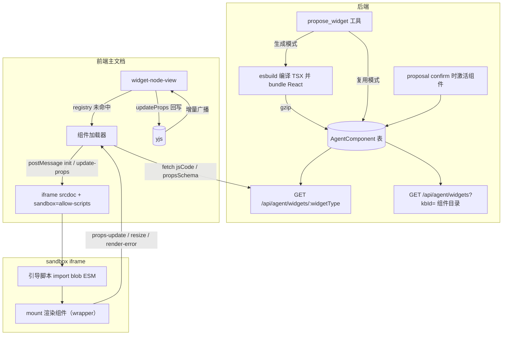
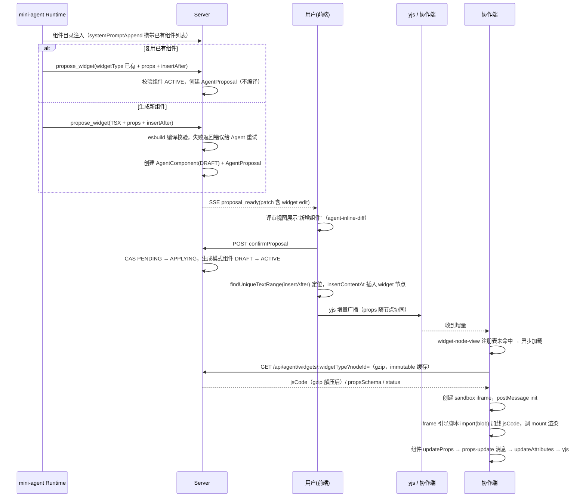

# Agent 生成任意 React 组件运行时（agent-widget-runtime）设计文档

## 1. 背景与目标

### 1.1 背景

协作文档（tiptap + yjs + websocket）目前支持一组预设 widget 组件（task-list、decision-record、project-status、callout、metric），通过统一的 `widget` 原子节点承载，组件状态以 JSON 形式存放在节点 `props` attribute 中，经 yjs 协同同步。预设组件机制成熟，但组件本体是编译期打包进前端 bundle 的，无法支撑"Agent 生成任意 React 组件"的能力。

### 1.2 目标

- Agent 按规范生成单文件 React 组件（TSX），经提案确认后插入文档，前端运行时加载并在沙箱中渲染。
- 组件状态以 JSON props 受控回写，复用现有 `widget` 节点与 yjs 协同链路，无需改动服务端协同层。
- 前端 UI 不开放任意组件插入入口，任意组件只能由 Agent 生成，且必须经过用户提案确认。
- 组件代码渲染在 sandbox iframe 内，与主文档隔离，作为 LLM 输出不可信场景的纵深防御。

### 1.3 关键设计决策

| 决策点       | 选择                                                                                                                     | 理由                                                                                                                                                                  |
| ------------ | ------------------------------------------------------------------------------------------------------------------------ | --------------------------------------------------------------------------------------------------------------------------------------------------------------------- |
| 组件代码存放 | 后端注册表（AgentComponent 表），文档内只存 `widgetType` + `props`                                                       | 代码静态、props 动态，分离后 yjs 只同步小体积 props；任何客户端打开文档都能按需拉取代码，不依赖协同历史                                                               |
| 构建产物存储 | jsCode gzip 压缩后存 DB（BYTEA），接口按 `Accept-Encoding` 返回 gzip，配合 immutable 强缓存                              | 自包含 ESM 原始 200-400KB，gzip 后约 40-60KB，数据库存储零负担；同版本代码不可变，前端只拉一次；组件量增长后可迁移对象存储（DB 只存元数据），当前规模不引入新基础设施 |
| 编译时机     | 后端 Node 环境用 esbuild 编译 TSX 为自包含 ESM（bundle React），存编译产物                                               | 规避 Vite 生产构建下 blob 动态 import 的已知 bug（vitejs/vite#16140）；前端零编译依赖、零外网依赖                                                                     |
| 渲染隔离     | sandbox iframe（`allow-scripts`，不带 `allow-same-origin`）+ postMessage 协议                                            | LLM 输出可能被 prompt injection 污染，防御放在代码执行边界；iframe 内自建 React 实例，与主文档天然隔离                                                                |
| 组件规范     | 受控组件契约（props 进、updateProps 出），仅 React 内置 API                                                              | 与现有 `WidgetProps` 契约对齐，props JSON 可序列化是 yjs 协同的硬前提                                                                                                 |
| 组件复用     | 第一版做复用：系统提示注入组件目录，Agent 优先引用已有组件（不写代码只填 props）；版本演进（同 widgetType 升级）留第二版 | 复用让 `version` 字段有真实语义、避免重复生成重复 bundle；第一版每个组件一版，数据模型按多版本设计预留                                                                |

### 1.4 配套设计依赖

- **agent-inline-diff**（`.comate/specs/agent-inline-diff/doc.md`）：承担提案的评审视图展示、确认与冲突交互，widget edit 的应用逻辑（`proposal-applier.ts` 的 kind 分支、`findUniqueTextRange` 导出）由本设计与该设计共同改动，必须放在同一实施计划中合并处理。
- 服务端协同层与 yjs codec 零改动。

## 2. 当前代码库现状

### 2.1 widget 节点与注册表

- `apps/doc-web/src/extensions/widget/widget.ts`：原子块级 Node，attrs 为 `widgetType` / `version` / `props`（`Record<string, unknown>`），HTML 往返经 `JSON.stringify` / `JSON.parse`。
- `apps/doc-web/src/extensions/widget/registry.ts`：同步 `Map<string, WidgetDefinition>`，`registerWidget` / `getWidget` / `listWidgets`，无异步加载形态。
- `apps/doc-web/src/extensions/widget/widget-node-view.tsx`：`getWidget(widgetType)` 未命中时渲染虚线 "Unknown widget" 占位框；`handleUpdateProps` 调 `updateAttributes({ props })` 回写文档（L104-112）；选中态与协作光标（awareness nodeCursor）由 NodeView 统一管理（L19-40）。
- `apps/doc-web/src/extensions/widget/presets/index.tsx`：5 个预设，`registerPresetWidgets()` 在 `knowledge-base-view/index.tsx` 模块加载时执行。

### 2.2 Agent 提案链路

- `apps/server/src/agent/tools/propose-document-patch.tool.ts`：唯一工具，schema 只有 `baseContent` + `newText` 字符串，patch 落 `AgentProposal.patch`（Json 列，无结构约束）。
- `apps/server/prisma/schema.prisma`（L301-323）：`AgentProposal` 表，状态机 PENDING → APPLYING → APPLIED / REJECTED / STALE / EXPIRED，`confirmProposal` 为原子 CAS。
- `apps/doc-web/src/agent/proposal-applier.ts`：`resolveEditRange` 优先相对位置锚点（ySync binding），回退 `findUniqueTextRange`（仅匹配单 text node 内唯一连续子串）；校验通过后 `insertContentAt` 单事务应用。`insertContentAt` 第二参数为 tiptap `Content`，可直接传 JSON 节点对象（`{ type: 'widget', attrs: {...} }`），写入能力现成。
- `apps/doc-web/src/agent/agent.types.ts`：`AgentEdit` 只有 `fromRelPos` / `toRelPos` / `baseContent` / `newText`。

### 2.3 mini-agent 运行时

- `packages/mini-agent/src/agent-runtime.ts`：SYSTEM_PROMPT 硬编码（L20-24），工具以 `RunRequest.tools` 数组注入，`AgentTool.inputSchema` 支持任意 JSON Schema。
- `packages/mini-agent/src/types.ts`：`AgentTool` 契约（name / description / inputSchema / riskLevel / execute）。

### 2.4 服务端协同层

- `apps/server/src/collab/`：自研 y-websocket 协议，服务端只做二进制转发与 `Y.encodeStateAsUpdate` 持久化，不感知节点类型；读模式经 `yjs-json-codec.ts` 解码为 ProseMirror JSON。**本次改造服务端协同层零改动**。

## 3. 架构与技术设计

### 3.1 总体架构



### 3.2 组件规范（Agent 生成契约）

Agent 生成的组件必须遵循以下规范，规范通过系统提示（systemPromptAppend，见 3.5）与 `propose_widget` 工具描述注入：

```tsx
// 组件 props 契约，与现有 WidgetProps 对齐（selected 由 NodeView 管理，不传给 iframe）
interface WidgetSandboxProps {
  props: Record<string, unknown>;
  updateProps: (next: Record<string, unknown>) => void;
  mode: 'edit' | 'read';
  editable: boolean;
}

// 单文件 TSX，默认导出组件
export default function MyWidget(props: WidgetSandboxProps) {
  // 仅允许 React 内置 API（useState / useEffect / useMemo / createElement 等）
  // 禁止 import 任何第三方库；组件自身不 import react-dom（挂载逻辑由服务端包装入口统一提供）
  // 状态必须通过 props.updateProps 回写，内部 useState 不会跨端同步
  // props 必须 JSON 可序列化：string / number / boolean / null / array / object
  // 禁止函数、Date、Map、Set、循环引用
  // 组件应自适应容器宽度；高度由沙箱引导脚本用 ResizeObserver 自动上报，组件零感知
}
```

### 3.3 后端设计

#### 数据模型

```prisma
model AgentComponent {
  id          String                @id @default(cuid())   // 每个版本一条记录（版本演进预留）
  widgetType  String                                        // 组件身份，稳定不变，文档节点引用它
  kbId        String                                        // 组件归属知识库，渲染时按此校验访问权限
  title       String
  version     Int                   @default(1)             // 第一版每组件一版，多版本语义预留
  sourceCode  String                                        // TSX 源码
  jsCodeGzip  Bytes                                         // esbuild 产物（自包含 ESM）gzip 压缩后存储
  propsSchema Json?                                         // 组件 props 的 JSON Schema，第一版仅存储
  status      AgentComponentStatus @default(DRAFT)          // DRAFT / ACTIVE / DISABLED
  createdAt   DateTime              @default(now())
  updatedAt   DateTime              @updatedAt

  @@unique([widgetType, version])
}

enum AgentComponentStatus {
  DRAFT
  ACTIVE
  DISABLED
}
```

#### esbuild 编译

- 编译发生在 `propose_widget` 工具执行期（Node 侧），失败则向 Agent 返回结构化错误，Agent 据此修正源码重试，形成第一层校验闭环。
- **编译入口是服务端生成的包装文件**，不是组件源码本身。包装文件在内存中拼接，内容为：

```ts
import * as React from 'react'; // 显式 createElement 需要 React 命名空间
import Widget from './agent-widget.tsx'; // Agent 产出的组件源码
import { createRoot, type Root } from 'react-dom/client';

let root: Root | null = null;
let currentProps: Record<string, unknown> = {};
let onPropsChange: ((p: unknown) => void) | null = null;

export function mount(
  container: HTMLElement,
  props: unknown,
  options: { mode: 'edit' | 'read'; editable: boolean },
  cb: { onPropsChange: (p: unknown) => void } | null
): void {
  onPropsChange = cb?.onPropsChange ?? null;
  currentProps = props as Record<string, unknown>;
  root = createRoot(container);
  root.render(
    React.createElement(Widget, {
      props: currentProps,
      updateProps: (next: unknown) => onPropsChange?.(next),
      mode: options.mode,
      editable: options.editable,
    })
  );
}
export function updateProps(props: unknown): void {
  /* root.render 更新 */
}
export function unmount(): void {
  root?.unmount();
  root = null;
}
```

- 关键配置：`bundle: true`、`format: 'esm'`、`jsx: 'automatic'`、`define: { 'process.env.NODE_ENV': '"production"' }`、`minify: true`。react 与 react-dom/client 随包装入口一并内联，**产物是 iframe 内唯一的 React 副本**，避免 iframe 内出现两份 React 导致 hooks 失效（"Invalid hook call"）。
- 产物压缩：编译完成后 `zlib.gzipSync` 压缩存入 `jsCodeGzip`（BYTEA），原始 200-400KB 压到约 40-60KB；接口按请求 `Accept-Encoding` 决定返回 gzip 还是解压后明文。
- 依赖归属：esbuild 为工具运行时调用，放 server 的 `dependencies`；react / react-dom 仅编译期解析用，放 `devDependencies`（版本与 doc-web 一致，pnpm 复用 store）。若未来以 `--omit=dev` 部署，需将 react 系移入 dependencies，demo 阶段可接受现状。

#### 工具与接口

- `propose_widget` 工具（见 3.5），支持"生成新组件"与"复用已有组件"两种模式。
- `GET /api/agent/widgets?kbId=xxx`：**组件目录**，返回知识库内 ACTIVE 组件列表（widgetType / title / version / propsSchema，不含代码），供 Agent 上下文注入与复用决策。权限模型与详情接口一致：校验调用者对该知识库的访问权限（VIEWER 及以上）。
- `GET /api/agent/widgets/:widgetType?nodeId=xxx`：返回 `{ widgetType, title, version, propsSchema, jsCode, status }`。服务端由 nodeId 定位所属知识库并校验用户访问权限（VIEWER 及以上可读）。status 非 ACTIVE 返回 404。传输层用 `Content-Encoding: gzip`（浏览器透明解压，响应带 `Vary: Accept-Encoding`）；因同一版本代码不可变，响应头 `Cache-Control: private, max-age=31536000, immutable`，配合前端加载器缓存，同版本组件只传输一次。
- `confirmProposal`（复用现有接口）在原子迁移 PENDING → APPLYING 成功后，将关联组件 DRAFT → ACTIVE。因 `widgetType` 非唯一字段（`@@unique([widgetType, version])`），激活实现必须为 `updateMany({ where: { widgetType, status: 'DRAFT' } })`，复用模式（引用已 ACTIVE 组件）自然成为无害 no-op。组件激活与用户确认绑定，未确认提案的组件永不生效。

### 3.4 前端设计

#### 组件加载器

新文件 `apps/doc-web/src/extensions/widget/agent-widget-loader.ts`：

- 模块级缓存 `Map<widgetType, Promise<AgentWidgetMeta>>`，避免重复 fetch；会话内生效，刷新后重新拉取（配合接口 immutable 缓存，同版本实际只传输一次）。
- `loadAgentWidget(widgetType, ctx)`：ctx 提供 nodeId / kbId（来自 editor storage，见下），fetch 组件元数据（gzip 为传输层 `Content-Encoding`，浏览器透明解压），返回 jsCode 与 schema。
- `widget-node-view` 渲染分支：
  1. `getWidget(widgetType)` 命中（预设组件）：走现有 React NodeView 渲染路径，行为不变。
  2. 未命中：进入异步加载态，显示 Spin + "组件加载中"；成功后创建 sandbox iframe 渲染；失败（404 / 网络错误 / 超时）显示错误占位 + 重试按钮。
  3. 加载结果明确为不存在：保持现有 "Unknown widget" 占位。

- kbId 上下文：`knowledge-base-view` 在创建编辑器时把当前 kbId 写入 `editor.storage`（例如 `editor.storage.widgetRuntime = { kbId, nodeId }`），加载器从 editor storage 读取，避免模块级全局状态。

#### sandbox iframe 与 postMessage 协议

新文件 `apps/doc-web/src/extensions/widget/widget-sandbox.tsx`：

- iframe 属性：`sandbox="allow-scripts"`（不带 `allow-same-origin`，避免 opaque origin 被解除）、`srcdoc` 为最小 HTML 骨架（含基础 reset CSS 与消息引导脚本）。
- 主文档通过 postMessage 把 jsCode 字符串传入 iframe；iframe 引导脚本 `new Blob([jsCode], { type: 'text/javascript' })` + `import(URL.createObjectURL(blob))` 加载组件模块（import 成功后 `revokeObjectURL`），随后调用模块暴露的 `mount(container, props, options, callbacks)` 完成 `createRoot` 渲染（options 含 mode / editable，callbacks 含 onPropsChange）。挂载容器由引导脚本在 srcdoc 中创建，React 为 iframe 自身副本，与主文档隔离。`update-props` 消息可能先于模块 import 完成到达，引导脚本需缓冲最近一次 props，mount 后立即应用。
- 高度上报：引导脚本对挂载容器挂 ResizeObserver，容器尺寸变化时发 `resize` 消息，组件零感知。
- 消息协议（双向白名单校验：`event.source === iframe.contentWindow` 且 `event.origin === 'null'`，消息体按 type 白名单解析）：

```ts
type HostToFrame =
  | {
      type: 'init';
      payload: { jsCode: string; props: unknown; mode: 'edit' | 'read'; editable: boolean };
    }
  | { type: 'update-props'; props: unknown };

type FrameToHost =
  | { type: 'ready' }
  | { type: 'props-update'; props: unknown } // 组件调 updateProps 后回传
  | { type: 'resize'; height: number } // iframe 引导脚本用 ResizeObserver 上报容器高度，主文档同步 iframe 高度
  | { type: 'render-error'; message: string; stack?: string };
```

- props 变化闭环：iframe 内组件 `updateProps(next)` → `props-update` 消息 → 主文档 `updateAttributes({ props: next })` → yjs 同步 → 其他协作者 widget 节点 attrs 更新 → 各自 iframe 收到 `update-props` 消息 → 组件重渲染。
- 组件内部高频更新（拖拽滑块等）在规范中要求节流 updateProps（例如连续拖拽用本地 state + 松手回写），避免每个帧都触发 yjs 写入。
- 选中态、协作光标、拖拽手柄继续由 widget-node-view 的 wrapper 统一管理，iframe 只作为内容区，保证与预设组件交互一致。

#### proposal-applier 扩展

- `AgentEdit` 扩展为判别联合：

```ts
type AgentEdit =
  | { kind?: 'text'; baseContent: string; newText: string }
  | {
      kind: 'widget';
      widgetType: string;
      title: string;
      props: Record<string, unknown>;
      insertAfter: string;
    };
```

- 应用逻辑：`kind: 'text'` 走现有路径；`kind: 'widget'` 用 `findUniqueTextRange(insertAfter)` 解析锚点，在 `range.to` 后 `insertContentAt` 插入 `{ type: 'widget', attrs: { widgetType, props } }`；内容快照校验对 widget edit 跳过（无 baseContent 对比）。
- 实现注意：`proposal-applier.ts` 中 `findUniqueTextRange` 目前是模块私有函数，需先导出；`resolveEditRange`、内容快照校验、`insertContentAt` 三处需先按 `kind` 分支再访问 `baseContent` / `newText`（当前 L57 / L117 / L141 无条件访问，widget edit 无这两个字段）。
- 锚点缺失（insertAfter 匹配不到或非唯一）按现有冲突语义返回 `not_found` / `ambiguous`。

#### Agent 工作区展示

- 提案的 diff 展示由配套设计 `agent-inline-diff`（文档变更评审视图）承担：提案到达后进入客户端本地评审视图，widget edit 在 Preview 中显示"新增组件"高亮占位，确认后按 edit 粒度应用。本设计不再维护聊天区 JSON diff 卡片。

### 3.5 Agent 侧设计

#### 新工具 propose_widget

```ts
{
  name: 'propose_widget',
  description: '插入一个 React 组件到文档。两种模式：1. 复用已有组件（组件目录中的 widgetType，不提供 sourceCode，只填 props）；' +
    '2. 生成新组件（提供 sourceCode，单文件 TSX 默认导出，仅 React 内置 API，状态经 updateProps 回写，props 必须 JSON 可序列化）。',
  inputSchema: {
    type: 'object',
    properties: {
      widgetType:  { type: 'string', description: '组件身份标识，格式 w_<随机后缀>；复用模式填目录中的已有 widgetType' },
      title:       { type: 'string', description: '组件展示名（生成模式必填）' },
      sourceCode:  { type: 'string', description: '单文件 TSX 源码（生成模式必填，复用模式省略）' },
      props:       { type: 'object', description: '初始 props，JSON 可序列化' },
      insertAfter: { type: 'string', description: '插入位置锚点文本，组件插入到该文本之后' },
    },
    required: ['widgetType', 'props', 'insertAfter'],
  },
  riskLevel: 'write_proposal',
}
```

- 生成模式执行流程：esbuild 编译校验 → 创建 `AgentComponent`（DRAFT）→ 创建 `AgentProposal`（patch 含 widget edit）→ 返回 proposalId 与编译结果摘要。
- 复用模式执行流程：校验 widgetType 在组件目录中存在且 ACTIVE → 直接创建 `AgentProposal`（patch 含 widget edit，widgetType 引用已有组件，title 由服务端从组件行回填供评审视图展示），无编译、无新代码。
- 编译失败时返回结构化错误（错误信息 + 行号），Agent 修正后重试，最多按现有 maxSteps 约束执行。
- 权限：与现有选区改写一致，要求 OWNER / EDITOR。

#### SYSTEM_PROMPT 扩展

- 组件生成规范不直接写进 `packages/mini-agent` 的硬编码 SYSTEM_PROMPT（该包是通用运行时，不应耦合本应用特有的 widget 规则）。改为 `RunRequest` 增加可选的 `systemPromptAppend` 字段，由 server 侧 orchestrator 组装注入。
- 追加内容：
  - **组件目录**：当前知识库已有组件列表（widgetType / title / propsSchema 摘要），要求 Agent 优先复用已有组件，仅当无合适组件时才生成新代码。
  - 生成规范：受控契约、JSON 序列化约束、仅 React 内置 API、自包含样式、禁止外部网络请求与弹窗、组件生成后必须经用户确认才会生效。

## 4. 数据流



## 5. 关键接口与数据结构

- `AgentComponent` 模型：见 3.3（jsCodeGzip 为 gzip 压缩后的 BYTEA）。
- `GET /api/agent/widgets?kbId=`：组件目录（供 Agent 复用决策）。
- `GET /api/agent/widgets/:widgetType?nodeId=`：组件元数据拉取，返回 jsCode（gzip / 明文按 `Accept-Encoding`），响应 `Cache-Control: private, max-age=31536000, immutable`。实现时注意 `AgentProposal.patch` 为 Json 无结构约束，confirm 时解析 patch 中 widget edit 的 `widgetType` 再更新 `AgentComponent`（跨表非原子，顺序执行可接受）。
- `AgentEdit` 判别联合：见 3.4。
- postMessage 协议：见 3.4。
- `propose_widget` 工具 schema：见 3.5。
- jsCode 模块契约（服务端包装入口编译产物，见 3.3）：`mount(container, props, options, callbacks)` / `updateProps(props)` / `unmount()`，由 iframe 引导脚本调用。
- widget 节点 attrs 不变（`widgetType` / `version` / `props`），服务端协同层与 yjs codec 零改动。

## 6. 错误处理、兼容性与边界情况

| 场景                                              | 处理                                                                                                                    |
| ------------------------------------------------- | ----------------------------------------------------------------------------------------------------------------------- |
| 组件编译失败（生成期）                            | 工具返回结构化错误，Agent 修正重试；连续失败受 maxSteps 限制                                                            |
| 复用组件不存在 / 非 ACTIVE                        | 工具返回错误，提示 Agent 改用生成模式或选择目录中其他组件                                                               |
| 组件未激活（status 非 ACTIVE）                    | GET 返回 404，渲染"组件待确认/不可用"占位；v1 中该分支实际不可达（节点只在 confirm 激活之后才可能被插入），属防御性分支 |
| 孤儿组件（confirm 已激活但 apply 因锚点冲突失败） | 无节点引用的 ACTIVE 组件不生效，无害；被拒绝/过期的提案组件滞留 DRAFT，同样无害，暂不清理                               |
| 组件加载失败（网络 / 404）                        | 错误占位 + 重试按钮                                                                                                     |
| iframe 渲染错误（render-error）                   | 错误占位（含 message / stack 摘要）+ 重试按钮；不向组件注入任何 token 或敏感数据                                        |
| iframe 超时未 ready（10s）                        | 超时占位 + 重试按钮                                                                                                     |
| insertAfter 锚点缺失 / 不唯一                     | 按现有冲突语义返回 not_found / ambiguous，触发 Regenerate / Cancel 交互                                                 |
| props 高频更新                                    | 组件规范要求节流回写；更新本身经 yjs 增量合并，不阻塞                                                                   |
| 旧文档 / 预设组件                                 | 不受影响，`getWidget` 命中走原路径                                                                                      |
| 未知 widgetType（非预设且非 Agent 组件）          | 保持现有 "Unknown widget" 占位                                                                                          |
| 只读模式（版本预览 Modal）                        | 同一加载器渲染，mode='read'、editable=false 传给组件                                                                    |

## 7. 测试策略

- 单元测试：
  - esbuild 编译函数（合法 TSX 编译成功、非法语法返回结构化错误、产物为自包含 ESM 无外部 import）。
  - postMessage 消息协议编解码与白名单校验（非法 type / 错误 origin 丢弃）。
  - proposal-applier 的 widget edit 解析（锚点定位、插入位置、冲突语义）。
  - 组件加载器状态机（loading / ready / error / unknown）。
- 集成测试：
  - Agent 生成组件全链路（mock provider 产出 propose_widget 调用）→ 提案 → 确认 → 文档出现组件。
  - 双浏览器协同：一端 updateProps 后另一端 iframe 内组件 props 实时更新。
  - 只读预览模式渲染 Agent 组件。
- 手动验收：真实模型生成一个示例组件（如数据仪表盘）插入文档，验证沙箱渲染、高度自适应、协同回写。

## 8. 明确不做（第一版）

- 组件市场 / 组件浏览 / 在线编辑 UI。
- 组件内使用第三方 npm 库（仅 React 内置，esbuild 内联 react 系）。
- propsSchema 驱动的属性面板（schema 先存储，留作演进）。
- 组件版本演进（同 widgetType 升级新版本、旧文档按版本兼容渲染、props 迁移）：第一版每个组件一版，Agent 复用已有组件或生成新组件；数据模型已按多版本预留（componentId 唯一、widgetType+version 联合唯一），版本演进留第二版。
- 完整的 playground 重试闭环（生成 → 运行时报错 → 自动反馈重试），第一版仅编译期校验 + 前端错误占位。
- 服务端渲染 / 导出静态文档中的组件。
- 组件代码持久化缓存（localStorage / IndexedDB），第一版会话内缓存 + HTTP immutable 缓存。
