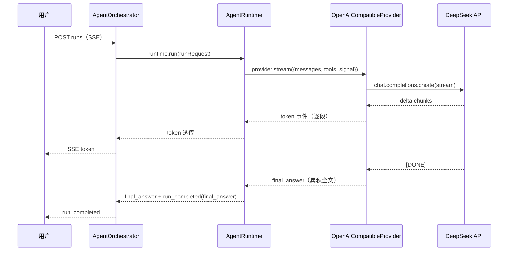
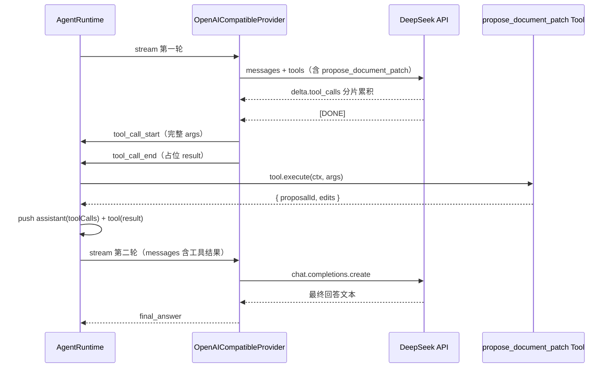

# Agent 真实大模型接入（Real Model Integration）

## 背景与目标

### 背景

Agent 闭环已打通：会话入库、多轮消息流、提案 diff 卡片、打字机输出、历史重建均已就绪（见 `.comate/specs/agent-chat-panel/doc.md`）。但所有回复来自 `MockModelProvider`（`packages/mini-agent/src/mock-provider.ts`），是硬编码文本，不具备真实推理能力。

模型接入位置已预留：`ModelProvider` 接口（`packages/mini-agent/src/types.ts:67-69`）是唯一契约，`AgentRuntime` 只依赖该接口，`apps/server/src/agent/agent-orchestrator.ts:109` 是唯一实例化点（`new MockModelProvider()`）。

### 目标

1. 接入真实大模型：选用 DeepSeek（OpenAI 兼容协议），通过 `openai` npm 包连接，支持流式输出与 function calling（改写工具调用链路）。
2. 配置驱动切换：`LLM_PROVIDER` env 在 `mock` / `openai` 间切换，无 key 时 demo 照常运行。
3. 前端零改动：SSE 事件契约（`SseAgentEvent`）不变，改动全部在后端 mini-agent 与 server。

## 当前代码库现状

| 模块          | 位置                                                           | 现状                                                                                                                                                                |
| ------------- | -------------------------------------------------------------- | ------------------------------------------------------------------------------------------------------------------------------------------------------------------- |
| Provider 契约 | `packages/mini-agent/src/types.ts`                             | `ModelRequest` 含 `messages/tools/maxTokens/signal`，与 OpenAI 兼容 API 对齐，无需改动                                                                              |
| Mock Provider | `packages/mini-agent/src/mock-provider.ts`                     | 一次 `stream()` 内 fake 掉整个工具调用（`tool_call_start` → `tool_call_end` 带 result）                                                                             |
| Agent Runtime | `packages/mini-agent/src/agent-runtime.ts`                     | `while` 循环多次调 `stream()`；收到 `tool_call_end` 才执行工具；**assistant 消息 `toolCalls: []` 硬编码为空数组**（L195-201）                                       |
| 编排器        | `apps/server/src/agent/agent-orchestrator.ts`                  | `new MockModelProvider()`（L109）；`createRun` 的 `modelName: 'mock'` 硬编码（L56）；**忽略 runtime 的 `run_completed(error)`，循环后一律走 COMPLETED**（L129-188） |
| DI 与配置     | `apps/server/src/agent/agent.module.ts`、`app.module.ts`       | `ConfigModule.forRoot({ isGlobal: true })` 已全局；env 文件在仓库根目录（npm script 用 `dotenv_config_path=../../.env` 加载）                                       |
| 依赖          | `apps/server/package.json`、`packages/mini-agent/package.json` | 均无 openai/ai SDK 相关依赖；pnpm workspace                                                                                                                         |
| 前端          | `apps/doc-web/src/agent/*`                                     | SSE 事件消费，本次不动                                                                                                                                              |

## 架构与技术设计

### 1. Provider 抽象与 ModelEvent 契约（不动）

`ModelProvider.stream()` 签名不变。`tool_call_start` / `tool_call_end` / `token` / `final_answer` / `error` 五类事件不变。前端 SSE 透传逻辑不变。

### 2. 新增 OpenAICompatibleModelProvider（mini-agent 包内）

新建 `packages/mini-agent/src/openai-compatible-provider.ts`，与 `MockModelProvider` 同级，从 `index.ts` 导出；`openai` 包加入 mini-agent 的 dependencies。

```ts
interface OpenAICompatibleConfig {
  apiKey: string;
  baseURL: string; // 如 https://api.deepseek.com，任意 OpenAI 兼容端点
  model: string;   // 如 deepseek-chat
}

class OpenAICompatibleModelProvider implements ModelProvider {
  constructor(private readonly config: OpenAICompatibleConfig) {}
  async *stream(request: ModelRequest): AsyncIterable<ModelEvent> { ... }
}
```

`stream()` 内部逻辑：

1. 把 `request.tools: ToolSchema[]` 转为 OpenAI 格式 `{ type: 'function', function: { name, description, parameters } }`；`maxTokens` 映射为 `max_tokens`；`request.signal` 透传给 SDK（abort 联动，对齐现有 `AbortSignal.timeout(runTimeoutMs)` 超时机制）。
2. `client.chat.completions.create({ model, messages, tools, stream: true, ... })`，for-await 消费 chunk：
   - `delta.content` → yield `token` 事件，同时本地累积完整文本。
   - `delta.tool_calls` 按 `index` 累积（OpenAI 兼容协议中 `function.arguments` 是分片 JSON 字符串，流结束后合并再 `JSON.parse`）。
   - `delta.reasoning_content`（DeepSeek 思考内容）忽略，不透传（前端无思考链展示需求）。
3. 流结束（`[DONE]`）后：
   - 累积到 tool_calls：依次 yield `tool_call_start`（完整解析后的 args）与 `tool_call_end`（result 为占位值，见第 3 节约定）。
   - 无 tool_calls：yield `final_answer`（text 为累积的完整 content，与 token 文本一致）。
4. 异常（鉴权失败、网络错误、429 等）统一 catch，yield `{ type: 'error', message }`，不抛给 runtime。

### 3. tool_call_end 语义约定

真实模型只返回工具调用参数，不返回执行结果。约定如下（runtime 现状已天然支持，无需改动执行逻辑）：

- Provider 发出的 `tool_call_end.result` 为占位值，**runtime 收到后忽略该字段**，从 `pendingToolArgs` 取参数自行执行工具，并以真实 result 重新 yield `tool_call_end`（`agent-runtime.ts:104-158` 现状即如此）。
- Provider 必须遵循"`tool_call_start` 后紧跟 `tool_call_end`"的发出顺序，Mock 与真实 Provider 行为对齐。

### 4. AgentRuntime 修复（工具调用历史）

当前 `agent-runtime.ts:195-201` 在工具调用后 push 的 assistant 消息 `toolCalls: []` 是空数组。Mock 不校验所以未暴露，但真实 OpenAI 兼容 API 要求 assistant 消息携带 `tool_calls` 且 `tool` 消息的 `toolCallId` 与之对应，否则第二轮请求报错。

修改：`tool_call_start` 分支中把 `{ id: toolCallId, name: toolName, args }` 收集到本轮数组（同时累积本轮 content 文本），push assistant 消息时填入真实 `toolCalls` 与 content。其余循环逻辑不动。

### 5. AgentOrchestrator 修复（非 final_answer 结束分支）

现状缺陷：runtime 内部 yield `run_completed(reason: 'error' | 'budget_exhausted' | 'cancelled')` 后 generator 正常返回，orchestrator 的 for-await 不抛异常，循环后无 proposals 即一律置 `COMPLETED`（`agent-orchestrator.ts:178-187`），错误路径状态被污染。Mock 从不发 `error` 事件所以未暴露，真实 Provider 会触发。

修改：orchestrator 记录循环中最后一个 `run_completed` 的 reason；reason 非 `final_answer` 时，按映射更新 run 状态（error → FAILED、budget_exhausted → BUDGET_EXHAUSTED、cancelled → CANCELLED，error 文案落 `error` 字段）并透传事件后 return，不走 COMPLETED 分支。

### 6. Provider 工厂与 DI（server 端）

新建 `apps/server/src/agent/model-provider.factory.ts`：

```ts
interface ModelProviderSelection {
  provider: ModelProvider;
  modelName: string; // 落库用，mock 为 'mock'，真实为配置的模型名
}
function createModelProvider(config: ConfigService): ModelProviderSelection { ... }
```

`AgentModule` 中以 `useFactory` + `ConfigService` 提供 `MODEL_PROVIDER` token，`AgentOrchestrator` 构造注入（现状 `AgentModule` providers 只有 `[AgentOrchestrator, AgentService, ContextBuilder]`，本次新增 factory）。orchestrator 删除 `import { MockModelProvider }`，`createRun` 的 `modelName` 改为取 selection 的 modelName。

### 7. 配置项（仓库根目录 `.env.example` / `.env` 新增）

| 变量              | 默认值                     | 说明                                                                          |
| ----------------- | -------------------------- | ----------------------------------------------------------------------------- |
| `LLM_PROVIDER`    | `mock`                     | `mock` 或 `openai`                                                            |
| `OPENAI_API_KEY`  | 空                         | DeepSeek API key（`LLM_PROVIDER=openai` 时必填）                              |
| `OPENAI_BASE_URL` | `https://api.deepseek.com` | 任意 OpenAI 兼容端点，换厂商只改此项与模型名                                  |
| `OPENAI_MODEL`    | `deepseek-chat`            | 需支持 function calling；`deepseek-reasoner` 不支持工具调用，不可用于改写链路 |

沿用现有 SCREAMING_SNAKE_CASE 命名风格与根目录 env 文件位置。

## 数据流

### 问答路径（无工具调用）



### 工具调用路径（选区改写）



## 关键接口

- `OpenAICompatibleModelProvider`：构造 `{ apiKey, baseURL, model }`，实现 `stream(request: ModelRequest): AsyncIterable<ModelEvent>`。
- `createModelProvider(config: ConfigService): { provider: ModelProvider; modelName: string }`：按 `LLM_PROVIDER` 分支，mock 分支与现状等价。
- `AgentModule` 新增 `MODEL_PROVIDER` provider（useFactory）；`AgentOrchestrator` 构造注入。
- env 新增四项（见第 7 节配置表）。
- mini-agent `package.json` 新增 `openai` 依赖；`index.ts` 导出新 Provider。

## 错误处理、兼容性与边界情况

| 场景                                       | 处理                                                                                                                                    |
| ------------------------------------------ | --------------------------------------------------------------------------------------------------------------------------------------- |
| `LLM_PROVIDER=openai` 但缺 key / key 无效  | 启动不校验，请求时 SDK 抛错 → Provider catch → `error` 事件 → run FAILED + SSE 透传错误（demo 可接受）                                  |
| 网络错误 / 429 / 超时                      | 同上路径；SDK 请求被 `signal` abort 时 runtime 走 cancelled 分支                                                                        |
| 工具参数 JSON 解析失败                     | Provider yield `error` 事件，run 降级为 FAILED。不做消息配对（孤立 tool 消息会导致第二轮 API 报错，且解析失败属罕见场景，保持实现简单） |
| 模型选了 `deepseek-reasoner`（不支持工具） | 改写请求退化为问答回复，不崩溃；配置注释中说明                                                                                          |
| 无 key 且 `LLM_PROVIDER=mock`              | 行为与现状完全一致，全部现有测试不受影响                                                                                                |
| 模型输出 content 又调用工具                | token 先透传，工具调用随后执行，assistant 消息 content 与 toolCalls 均真实落库                                                          |
| 流中断（`[DONE]` 前断开）                  | Provider catch 网络错误 → `error` 事件，run FAILED                                                                                      |

## 测试策略

1. mini-agent 单测（`openai-compatible-provider.test.ts`，vi.mock 掉 openai 包，不真调 API）：
   - delta.content 分片 → 逐段 token + 最终 final_answer 全文一致。
   - delta.tool_calls 分片累积 + JSON.parse → tool_call_start 参数完整。
   - 鉴权失败/网络异常 → error 事件（不抛异常）。
   - signal 透传 SDK。
2. runtime 回归测试（**必做**，第 4 节修复的唯一验证手段）：工具调用一轮后，第二轮 stream 收到的 messages 中 assistant 消息 `toolCalls` 非空且与 tool 消息 `toolCallId` 对应。Mock 路径在同一 stream 内以 final_answer 结束、不触发 assistant 消息 push，无法覆盖该修复。
3. orchestrator 单测：runtime 发 `run_completed(error)` 时 run 落库为 FAILED 而非 COMPLETED（修复点）。
4. 手动验收（有 key）：`LLM_PROVIDER=openai` 下真实问答逐字输出；选区改写走工具调用并产出提案 diff，确认后写入文档；无 key 时切回 `mock` 全链路不受影响。

## 明确不做的内容

1. 不接千帆/通义等其他厂商（协议兼容，后续只改 `OPENAI_BASE_URL` 与模型名即可）。
2. 不做思考链（`reasoning_content`）透传与展示。
3. 不做 SDK 重试/退避策略（`openai` 包默认不重试，demo 可接受）。
4. 不做多模型热切换 UI 或配置热更新（重启生效）。
5. 不改 `ModelProvider` 协议本身，工具执行语义用第 3 节约定解决。
6. 不做 MCP/外部工具接入。
7. 前端零改动。
